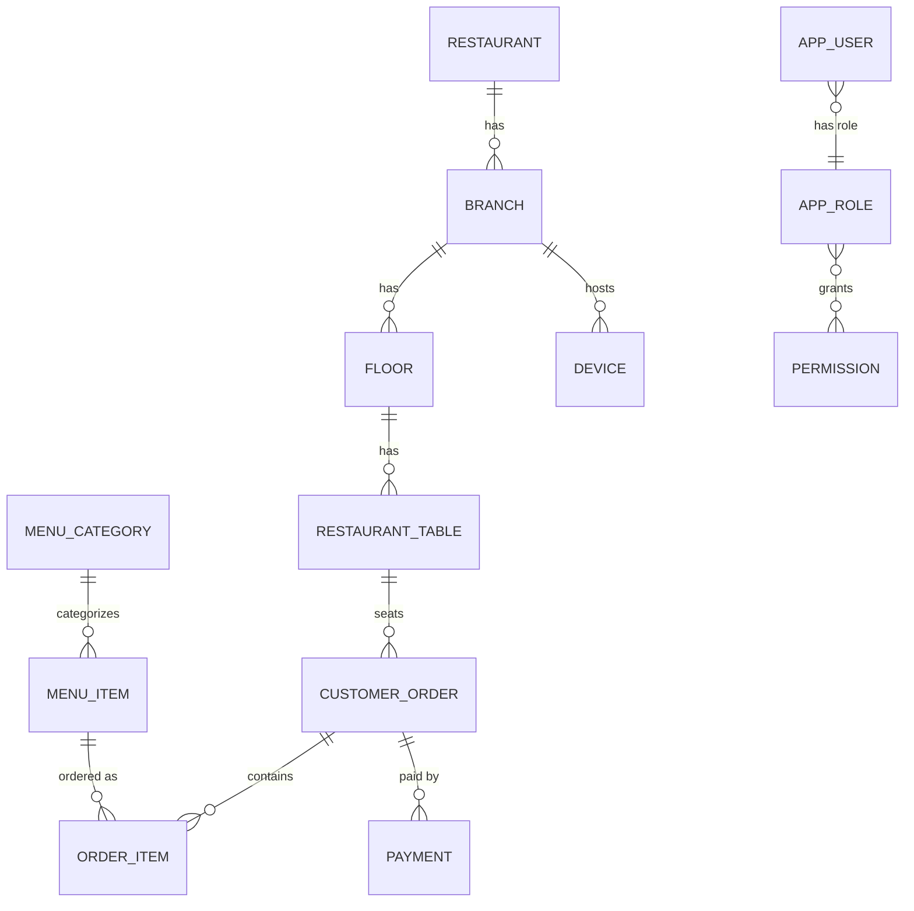

# ChefPay Data Dictionary

Generated from the JPA entity classes in `chefpay-core/src/main/java/com/chefpay/core/domain/` and
cross-checked against the Flyway migrations in `chefpay-server/src/main/resources/db/migration/`
(V1 through V27). This document covers every `@Entity` class in the domain package as of Round 18.

> **Source of truth split:** the `@Entity` classes are authoritative for *which* columns and
> relationships exist at all; the Flyway migrations (which run against the Postgres/MySQL
> production profiles — SQLite/dev uses `ddl-auto=update` instead, per every migration file's own
> header note) are authoritative for the *exact* column type/constraint in production. Where the
> two could differ (e.g. a length or precision Hibernate would leave ambiguous), the migration's
> value is what's shown below.

## Common base columns (`BaseEntity`)

Every entity below **except** `AuditLog`, `AuditChainState`, `IdempotencyRecord`, and
`NumberSequence` extends `BaseEntity` (a `@MappedSuperclass`), which contributes four columns that
are **not** repeated in the per-entity tables that follow:

| Column | Type | Nullable | Default/Constraint | Notes |
|---|---|---|---|---|
| `id` | UUID / CHAR(36) | NOT NULL | server-generated (`@UuidGenerator`) | Primary key. UUIDs (not sequential integers) so the API never leaks row counts, per requirement §60. |
| `version` | BIGINT | NOT NULL | starts at 0 | `@Version` optimistic-locking column — a stale write is rejected as a 409 `VERSION_CONFLICT` rather than silently overwritten (ARCHITECTURE.md §8). |
| `created_at` | TIMESTAMP | NOT NULL | set on `@PrePersist` | Immutable once written (`updatable = false`). |
| `updated_at` | TIMESTAMP | NOT NULL | set on every `@PreUpdate` | |

The four entities that skip `BaseEntity` are singleton/append-only/lookup rows with their own
hand-rolled identity scheme (a fixed string id, a natural key, or an append-only row that must
never carry a mutable `version`) — each is called out individually below.

Every non-PK UUID-typed column (foreign keys, free-floating reference ids like
`Anomaly.referenceEntityId`) is explicitly mapped `@JdbcTypeCode(SqlTypes.CHAR)` / `CHAR(36)` for
the same cross-database-portability reason as the PK: without it, Hibernate 6 assumes PostgreSQL's
native `uuid` type against a column the migrations actually create as `CHAR(36)`, which fails
schema validation at boot.

---

## Organization / Identity

*Restaurant → Branch → Floor → Device/Terminal — the physical/organizational tree everything else hangs off.*

### Restaurant (`restaurant`)

Root of the multi-branch tree; a single row is created on first boot for v1 deployments. It also
doubles as the restaurant-wide settings/config table — the large majority of its ~65 columns are
feature toggles and integration config added round-by-round (AI, EOD/loss-prevention, email
receipts, printing, branding) rather than "restaurant identity" fields in the strict sense.

| Column | Type | Nullable | Default/Constraint | Notes |
|---|---|---|---|---|
| `name` | VARCHAR(255) | NOT NULL | | |
| `organization_id` | VARCHAR(64) | nullable | blank on first boot, auto-filled with `ORG-XXXXXXXX` | Round 17 (V26). Groups multiple `Restaurant` rows under one org for a future multi-brand deployment. |
| `organization_name` | VARCHAR(255) | nullable | falls back to `name` | Round 17 (V26). |
| `currency_symbol` | VARCHAR(8) | NOT NULL | `"₹"` | |
| `default_timezone` | VARCHAR(64) | NOT NULL | `"Asia/Kolkata"` | |
| `gstin` | VARCHAR(32) | nullable | | |
| `support_phone` | VARCHAR(32) | nullable | | |
| `service_charge_percent` | DECIMAL(5,2) | NOT NULL | `0` | Flat % on (subtotal − discount). |
| `require_kitchen_sync_for_served` | BOOLEAN | NOT NULL | `true` | Gates whether "Mark Served" requires real KDS progression. |
| `receipt_footer_text` | VARCHAR(255) | nullable | | |
| `online_order_zomato_enabled` / `online_order_swiggy_enabled` | BOOLEAN | NOT NULL | `false` | Display-only toggles; no live aggregator API wired up. |
| `enabled_payment_methods` | VARCHAR(100) | NOT NULL | `"CASH,CARD,UPI"` | CSV of `PaymentMethod` names, not server-enforced. |
| `upi_vpa_id`, `upi_payee_name` | VARCHAR(255) | nullable | | UPI QR generation only, no PSP callback. |
| `card_payment_enabled`, `card_terminal_note` | BOOLEAN / VARCHAR(255) | NOT NULL / nullable | `false` | |
| `cash_drawer_enabled` | BOOLEAN | NOT NULL | `false` | ESC/POS drawer-kick via `receipt_printer_name`. |
| `receipt_printer_name` | VARCHAR(255) | nullable | | Silent/unattended print target. |
| `receipt_paper_width_chars` | INT | NOT NULL | `40` | |
| `auto_print_online_orders`, `auto_print_receipt_on_payment` | BOOLEAN | NOT NULL | `false` | |
| `delivery_boy_feature_enabled` | BOOLEAN | NOT NULL | `false` | |
| `kot_optional_enabled` | BOOLEAN | NOT NULL | `false` | Allows "Bill Directly (Skip Kitchen)". |
| `smtp_host`, `smtp_username`, `smtp_password`, `smtp_from_address` | VARCHAR(255) | nullable | | `smtp_password` never round-tripped back to client. |
| `smtp_port` | INT (boxed) | nullable | `587` | |
| `smtp_use_tls` | BOOLEAN | | `true` | |
| `logo_image_base64` | TEXT | nullable | | Base64 logo image (V9). |
| `ai_provider`, `ai_api_key`, `ai_model` | VARCHAR(255) | nullable | | `ai_api_key` write-only, never returned. |
| `ai_features_enabled`, `ai_menu_import_enabled`, `ai_insights_chat_enabled`, `ai_reorder_drafts_enabled`, `ai_anomaly_flagging_enabled`, `ai_menu_descriptions_enabled`, `ai_nightly_summary_enabled` | BOOLEAN | NOT NULL | `false` | Per-feature AI gates, ANDed with the master switch + a configured key. |
| `dashboard_view_mode` | VARCHAR(20) | NOT NULL | `"STANDARD"` | `STANDARD` \| `GRAPHICAL` \| `BOTH`. |
| `kitchen_service_mode` | VARCHAR(20) | NOT NULL | `"DETAILED"` | `DETAILED` \| `SIMPLE`. |
| `show_discount_confirmation` | BOOLEAN | NOT NULL | `true` | |
| `po_approval_required` | BOOLEAN | NOT NULL | `true` | |
| `ai_replenishment_notes_enabled` | BOOLEAN | NOT NULL | `false` | |
| `default_opening_float` | DECIMAL(12,2) | NOT NULL | `0` | Seeds a new `EodSession`. |
| `cash_variance_threshold` | DECIMAL(12,2) | NOT NULL | `100.00` | F1.2 acceptable-variance band. |
| `eod_z_report_recipient_emails` | VARCHAR(1000) | nullable | | CSV. |
| `margin_erosion_threshold_percent` | DECIMAL(5,2) | NOT NULL | `15.00` | Triggers a `PriceChangeSuggestion`. |
| `auto_po_from_suggestions_enabled` | BOOLEAN | NOT NULL | `false` | |
| `critical_alert_escalation_minutes` | INT | NOT NULL | `30` | |
| `critical_alert_recipient_emails` | VARCHAR(1000) | nullable | | CSV. |
| `nl_assistant_write_commands_enabled` | BOOLEAN | NOT NULL | `false` | |
| `ocr_use_ai_vision_assist` | BOOLEAN | NOT NULL | `false` | |
| `biometric_override_enabled` | BOOLEAN | NOT NULL | `false` | |
| `auto_purge_enabled` | BOOLEAN | NOT NULL | `false` | Master switch for scheduled data retention. |
| `data_retention_days` | INT | NOT NULL | `30` | |

**Relationships:** Parent of `Branch` (one-to-many, implicit via `Branch.restaurant`).

**Queried by:** `RestaurantRepository` has no custom finder methods (singleton row, fetched by id/`findAll().get(0)`-style get-or-create).

### Branch (`branch`)

A physical location under the `Restaurant` root — the unit most other tables (floors, devices,
purchase orders, printers) hang off in a multi-branch deployment.

| Column | Type | Nullable | Default/Constraint | Notes |
|---|---|---|---|---|
| `restaurant_id` | CHAR(36) FK | NOT NULL | → `restaurant.id` | |
| `name` | VARCHAR(255) | NOT NULL | | |
| `address` | VARCHAR(500) | nullable | | |
| `phone` | VARCHAR(32) | nullable | | |

**Relationships:**
- `restaurant` — `@ManyToOne(optional = false)` → `Restaurant`.
- Referenced by `Floor.branch`, `Area.branch`, `Device.branch`, `PurchaseOrder.branch`, `PrinterProfile.branch`, `SpecialNote.branch`, `Notification.branch`, and the `app_user_branch` / `AppUser.branches` join table (see Users & Access).

**Queried by:** `BranchRepository` has no custom finder methods (CRUD only).

### Floor (`floor`)

A physical level/floor of seating within a branch, grouping `RestaurantTable`s.

| Column | Type | Nullable | Default/Constraint | Notes |
|---|---|---|---|---|
| `branch_id` | CHAR(36) FK | NOT NULL | → `branch.id` | |
| `name` | VARCHAR(255) | NOT NULL | | |
| `display_order` | INT | NOT NULL | `0` | |

**Relationships:** `branch` — `@ManyToOne(optional = false)` → `Branch`. Parent of `RestaurantTable.floor`.

**Queried by:** `findAllByOrderByDisplayOrderAsc()`.

### Area (`area`)

A named seating section/zone within a branch (e.g. "Indoor", "Patio", "AC Hall") — Round 8. A
catalog used to populate `RestaurantTable.section`'s free-text field, not itself FK'd from the table.

| Column | Type | Nullable | Default/Constraint | Notes |
|---|---|---|---|---|
| `branch_id` | CHAR(36) FK | NOT NULL | → `branch.id` | |
| `name` | VARCHAR(255) | NOT NULL | | |
| `display_order` | INT | NOT NULL | `0` | |
| `active` | BOOLEAN | NOT NULL | `true` | |

**Relationships:** `branch` — `@ManyToOne(optional = false)` → `Branch`.

**Queried by:** `findByBranchIdOrderByDisplayOrderAsc`, `findByBranchIdAndActiveTrueOrderByDisplayOrderAsc`.

### Device (`device`)

A registered client instance (a JavaFX cashier terminal, a tablet, the kitchen display, ...). Also
**is** the "Terminal" of the Round 17 Organization/Branch/Terminal identity model — no separate
Terminal entity exists.

| Column | Type | Nullable | Default/Constraint | Notes |
|---|---|---|---|---|
| `name` | VARCHAR(255) | NOT NULL | | |
| `type` | VARCHAR(32), enum-as-STRING | NOT NULL | `DeviceType`: `JAVAFX_POS`, `WEB_TABLET`, `WEB_MOBILE`, `KITCHEN_DISPLAY`, `MANAGER_DASHBOARD` | |
| `last_user_id` | CHAR(36) FK | nullable | → `app_user.id` | |
| `last_seen_at` | TIMESTAMP | nullable | | |
| `branch_id` | CHAR(36) FK | nullable | → `branch.id`; added V26 | Round 17. Null on older rows/single-branch installs. |
| `terminal_code` | VARCHAR(32) | nullable | UNIQUE index (`idx_device_terminal_code`); added V26 | Short human-shown identity code, e.g. "T-4F2A". |
| `active` | BOOLEAN | NOT NULL | `true`; added V26 | Soft-disable a retired/lost terminal. |

**Relationships:** `lastUser` — `@ManyToOne` → `AppUser`. `branch` — `@ManyToOne` → `Branch` (Round 17).

**Queried by:** `findByNameIgnoreCase`, `findByTerminalCodeIgnoreCase`, `findAllByOrderByNameAsc`.

---

## Users & Access

*AppUser ↔ Role ↔ Permission RBAC, plus the `app_user_branch` join table for multi-branch access.*

### AppUser (`app_user`)

Named `AppUser` (not `User`) to avoid colliding with SQL reserved words and Spring Security's own
`User` type.

| Column | Type | Nullable | Default/Constraint | Notes |
|---|---|---|---|---|
| `username` | VARCHAR(64) | NOT NULL | UNIQUE | |
| `display_name` | VARCHAR(255) | NOT NULL | | |
| `password_hash` | VARCHAR(255) | NOT NULL | | BCrypt hash, never the raw password. |
| `pin_hash` | VARCHAR(255) | nullable | | BCrypt-hashed numeric PIN for fast terminal login. |
| `role_id` | CHAR(36) FK | NOT NULL | → `app_role.id` | |
| `active` | BOOLEAN | NOT NULL | `true` | |
| `default_branch_id` | CHAR(36) FK | nullable | → `branch.id` | Branch a terminal preselects for this user, skipping the branch-picker even with 2+ branches. |

**Relationships:**
- `role` — `@ManyToOne(optional = false)` → `Role`.
- `branches` — `@ManyToMany(fetch = EAGER)` → `Branch`, via join table **`app_user_branch`** (`app_user_id`, `branch_id`; composite PK; FKs to `app_user`/`branch`). This is a pure join table with no own entity class — an empty set means "no branch restriction" (every existing single-branch install has no rows here).
- `defaultBranch` — `@ManyToOne(fetch = LAZY)` → `Branch`.

**Queried by:** `findByUsernameIgnoreCase`, `findByActiveTrue`.

### Role (`app_role`)

Seed roles: ADMIN, MANAGER, CASHIER, WAITER, KITCHEN, VIEW_ONLY. The name is a stable code; actual
permission grants are fully configurable via `PATCH /api/roles/{id}/permissions`.

| Column | Type | Nullable | Default/Constraint | Notes |
|---|---|---|---|---|
| `name` | VARCHAR(64) | NOT NULL | UNIQUE | |
| `description` | VARCHAR(255) | nullable | | |

**Relationships:** `permissions` — `@ManyToMany(fetch = EAGER)` → `Permission`, via join table `role_permission` (`role_id`, `permission_id`; composite PK).

**Queried by:** `findByNameIgnoreCase`.

### Permission (`permission`)

A single grantable capability (e.g. `ORDER_CREATE`, `DISCOUNT_APPROVE`, `REPORT_VIEW`). Seeded as
data, not hardcoded into endpoint annotations, so an admin can regroup role↔permission mapping
without a code change.

| Column | Type | Nullable | Default/Constraint | Notes |
|---|---|---|---|---|
| `code` | VARCHAR(64) | NOT NULL | UNIQUE | |
| `description` | VARCHAR(255) | nullable | | |

**Relationships:** Referenced by `Role.permissions` (many-to-many).

**Queried by:** `findByCode`.

---

## Menu

*MenuCategory → MenuItem → KitchenStation routing, plus Recipe/RecipeLine costing and PriceChangeSuggestion.*

### MenuCategory (`menu_category`)

| Column | Type | Nullable | Default/Constraint | Notes |
|---|---|---|---|---|
| `name` | VARCHAR(255) | NOT NULL | UNIQUE | |
| `display_order` | INT | NOT NULL | `0` | |
| `active` | BOOLEAN | NOT NULL | `true` | |
| `parent_category_id` | CHAR(36) FK | nullable | → `menu_category.id`; added V27 | Round 18. Optional one-level-deep self-referencing parent (e.g. "Veg"/"Non-Veg" under "Main Course"); a subcategory may not itself have a parent (enforced in `MenuController`, not the DB). |

**Relationships:** `parentCategory` — `@ManyToOne` self-reference → `MenuCategory`. Parent of `MenuItem.category` and `Discount.applicableCategory`.

**Queried by:** `findByActiveTrueOrderByDisplayOrderAsc`, `findByNameIgnoreCase`, `existsByParentCategoryId`.

### MenuItem (`menu_item`)

| Column | Type | Nullable | Default/Constraint | Notes |
|---|---|---|---|---|
| `category_id` | CHAR(36) FK | NOT NULL | → `menu_category.id` | |
| `name` | VARCHAR(255) | NOT NULL | | |
| `sku`, `plu` | VARCHAR(64) | nullable | | |
| `description` | VARCHAR(1000) | nullable | | |
| `price` | DECIMAL(12,2) | NOT NULL | | |
| `tax_code` | VARCHAR(32) | nullable | | References a `Tax.code`; null = restaurant default rate. |
| `station_id` | CHAR(36) FK | nullable | → `kitchen_station.id` | |
| `vegetarian` | BOOLEAN | NOT NULL | `true` | Legacy flag, kept independent of `food_type` for backward compatibility. |
| `food_type` | VARCHAR(?), enum-as-STRING | NOT NULL | `FoodType.VEG`; `FoodType`: `VEG`, `EGG`, `NON_VEG` | Round 9 precise 3-way classification. |
| `available` | BOOLEAN | NOT NULL | `true` | |
| `active` | BOOLEAN | NOT NULL | `true` | |
| `image_path` | VARCHAR(500) | nullable | | |
| `barcode` | VARCHAR(64) | nullable | | |
| `direct_sale` | BOOLEAN | NOT NULL | `false` | When true, item never enters the kitchen workflow. |
| `half_price` | DECIMAL(12,2) | nullable | | Optional half-portion price. |
| `prep_time_minutes` | INT (boxed) | nullable | added V24 | Display-only estimate; not enforced anywhere. |

**Relationships:** `category` — `@ManyToOne(optional = false)` → `MenuCategory`. `station` — `@ManyToOne` → `KitchenStation`. Referenced by `OrderItem.menuItem`, `Recipe.menuItem` (one-to-one), `PriceChangeSuggestion.menuItem`.

**Queried by:** `findByActiveTrueOrderByNameAsc`, `findByCategoryIdAndActiveTrue`, `findByCategoryId`, `countByCategoryId`.

### KitchenStation (`kitchen_station`)

A physical/logical prep station (Grill, Cold/Salad, Beverages, Dessert...) `MenuItem` lines can be
routed to. Optional — a single-KDS kitchen can leave every item's station null.

| Column | Type | Nullable | Default/Constraint | Notes |
|---|---|---|---|---|
| `name` | VARCHAR(255) | NOT NULL | UNIQUE | |
| `display_order` | INT | NOT NULL | `0` | |
| `active` | BOOLEAN | NOT NULL | `true` | |

**Relationships:** Referenced by `MenuItem.station` (one-to-many).

**Queried by:** `findByActiveTrueOrderByDisplayOrderAsc`.

### Recipe (`recipe`)

The bill-of-materials link between one `MenuItem` and its `InventoryItem` ingredients (Round 14,
F2.1). Not every `MenuItem` has one — "no recipe" is the normal, expected case for uncosted items.

| Column | Type | Nullable | Default/Constraint | Notes |
|---|---|---|---|---|
| `menu_item_id` | CHAR(36) FK | NOT NULL | UNIQUE (`@OneToOne`) → `menu_item.id` | At most one recipe per menu item. |
| `servings_per_batch` | INT | NOT NULL | `1` | Divisor for batch-prepared recipes. |
| `active` | BOOLEAN | NOT NULL | `true` | |
| `notes` | VARCHAR(1000) | nullable | | |

**Relationships:** `menuItem` — `@OneToOne(optional = false)` → `MenuItem`. `lines` — `@OneToMany(mappedBy = "recipe", cascade = ALL, orphanRemoval = true)` → `RecipeLine`, ordered by `createdAt asc`.

**Queried by:** `findByMenuItemId`.

### RecipeLine (`recipe_line`)

One ingredient line of a `Recipe` — "`quantityPerBatch` of this `InventoryItem` (in the item's own
unit) makes `servingsPerBatch` servings."

| Column | Type | Nullable | Default/Constraint | Notes |
|---|---|---|---|---|
| `recipe_id` | CHAR(36) FK | NOT NULL | → `recipe.id` | |
| `inventory_item_id` | CHAR(36) FK | NOT NULL | → `inventory_item.id` | |
| `quantity_per_batch` | DECIMAL(14,3) | NOT NULL | | No unit-conversion engine — must match the inventory item's own tracked unit. |

**Relationships:** `recipe` — `@ManyToOne(optional = false)` → `Recipe`. `inventoryItem` — `@ManyToOne(optional = false)` → `InventoryItem`.

**Queried by:** `findByRecipeIdOrderByCreatedAtAsc`.

### PriceChangeSuggestion (`price_change_suggestion`)

Round 14 (F3.2) advisory dynamic-pricing suggestion, raised when a `MenuItem`'s recipe cost erodes
its margin below `Restaurant.marginErosionThresholdPercent`. Never auto-applied to `MenuItem.price`.

| Column | Type | Nullable | Default/Constraint | Notes |
|---|---|---|---|---|
| `menu_item_id` | CHAR(36) FK | NOT NULL | → `menu_item.id` | |
| `current_price` | DECIMAL(12,2) | NOT NULL | | |
| `current_recipe_cost` | DECIMAL(12,2) | NOT NULL | | |
| `current_margin_percent` | DECIMAL(5,2) | NOT NULL | | |
| `suggested_price` | DECIMAL(12,2) | NOT NULL | | |
| `projected_margin_percent` | DECIMAL(5,2) | NOT NULL | | |
| `reason` | VARCHAR(500) | NOT NULL | | |
| `status` | VARCHAR(15), enum-as-STRING | NOT NULL | `PriceChangeSuggestionStatus.PENDING`; values: `PENDING`, `APPLIED`, `DISMISSED` | |
| `detected_at` | TIMESTAMP | NOT NULL | | |
| `decided_by` | CHAR(36) FK | nullable | → `app_user.id` | |
| `decided_at` | TIMESTAMP | nullable | | |
| `decision_note` | VARCHAR(1000) | nullable | | |

**Relationships:** `menuItem` — `@ManyToOne(optional = false)` → `MenuItem`. `decidedBy` — `@ManyToOne` → `AppUser`.

**Queried by:** `findByStatusOrderByDetectedAtDesc`, `findFirstByMenuItemIdAndStatusOrderByDetectedAtDesc`.

---

## Tables & Orders

*RestaurantTable/Area → Order → OrderItem, the live-order backbone of the whole system.*

### RestaurantTable (`restaurant_table`)

| Column | Type | Nullable | Default/Constraint | Notes |
|---|---|---|---|---|
| `floor_id` | CHAR(36) FK | NOT NULL | → `floor.id` | |
| `name` | VARCHAR(64) | NOT NULL | | Display name/number, e.g. "T1". |
| `seating_capacity` | INT | NOT NULL | | |
| `section` | VARCHAR(64) | nullable | | Free-text sub-grouping; populated from the `Area` catalog by the UI. |
| `status` | VARCHAR(32), enum-as-STRING | NOT NULL | `TableStatus.AVAILABLE`; values: `AVAILABLE`, `RESERVED`, `OCCUPIED`, `ORDER_PLACED`, `PREPARING`, `READY`, `BILL_REQUESTED`, `PAYMENT_PENDING`, `CLOSED`, `BLOCKED` | Indexed (`idx_table_status`). |
| `grid_row`, `grid_column` | INT (boxed) | nullable | | Visual table-matrix grid position. |
| `active` | BOOLEAN | NOT NULL | `true` | |

**Relationships:** `floor` — `@ManyToOne(optional = false)` → `Floor`. Referenced by `Order.table` and `Reservation.table`.

**Queried by:** `findByActiveTrueOrderByGridRowAscGridColumnAsc`, `findByFloorId`, `findByFloor_Branch_IdAndActiveTrueOrderByGridRowAscGridColumnAsc`.

### Order (`customer_order`)

The single shared live order (requirement §2). Note the table name `customer_order` differs from
the class name — `order` collides with SQL. Any number of terminals may fetch/mutate the same row;
the inherited `@Version` column is what makes concurrent edits safe.

| Column | Type | Nullable | Default/Constraint | Notes |
|---|---|---|---|---|
| `order_number` | VARCHAR(255) | NOT NULL | UNIQUE | Generated via a `NumberSequence` series. |
| `order_type` | VARCHAR(?), enum-as-STRING | NOT NULL | `OrderType`: `DINE_IN`, `TAKEAWAY`, `QUICK_SERVICE`, `DELIVERY`, `PHONE_ORDER`, `ONLINE_ORDER` | |
| `table_id` | CHAR(36) FK | nullable | → `restaurant_table.id` | Required for DINE_IN/QUICK_SERVICE, null otherwise. |
| `customer_name`, `customer_phone` | VARCHAR(255) | nullable | | Lightweight inline capture, not FK'd to `Customer`. |
| `waiter_id`, `cashier_id` | CHAR(36) FK | nullable | → `app_user.id` | |
| `delivery_boy_id` | CHAR(36) FK | nullable | → `delivery_boy.id` | Round 9. |
| `status` | VARCHAR(?), enum-as-STRING | NOT NULL | `OrderStatus.DRAFT`; full lifecycle: `DRAFT→PLACED→SENT_TO_KITCHEN→ACCEPTED→PREPARING→READY→SERVED→BILL_REQUESTED→BILLED→PAYMENT_PENDING→PAID→CLOSED`, plus `CANCELLED` | Transitions enforced server-side via `canTransitionTo`. |
| `payment_status` | VARCHAR(?), enum-as-STRING | NOT NULL | `PaymentStatus.UNPAID`; values: `UNPAID`, `PARTIALLY_PAID`, `PAID`, `REFUNDED` | Independent dimension from `status`. |
| `priority` | VARCHAR(?), enum-as-STRING | NOT NULL | `KitchenPriority.NORMAL`; values: `NORMAL`, `HIGH`, `URGENT` | |
| `subtotal`, `discount_amount`, `tax_amount`, `service_charge_amount`, `tip_amount`, `total_amount` | DECIMAL(12,2) | NOT NULL | `0` each | Server-computed via `recalculateTotals()`; never trusted from a client. |
| `discount_reason` | VARCHAR(255) | nullable | | |
| `notes` | VARCHAR(255) | nullable | | |
| `sent_to_kitchen_at`, `billed_at`, `paid_at`, `closed_at` | TIMESTAMP | nullable | | |

**Relationships:**
- `table` — `@ManyToOne` → `RestaurantTable`.
- `waiter`, `cashier` — `@ManyToOne` → `AppUser` (two separate roles on the same order).
- `deliveryBoy` — `@ManyToOne` → `DeliveryBoy`.
- `items` — `@OneToMany(mappedBy = "order", cascade = ALL, orphanRemoval = true)` → `OrderItem`, ordered by `createdAt asc`.
- Referenced by `Payment.order` (one-to-many).

**Queried by:** `findByStatusNotInOrderByPriorityDescCreatedAtAsc`, `findByStatusNotInAndBranch`, `findFirstByTableIdAndStatusNotIn`, `findByOrderNumber`, `findByPaymentStatusInAndBilledAtIsNotNullOrderByBilledAtAsc`, `findByBilledAtBetween` (reporting/EOD queries).

### OrderItem (`order_item`)

One line of a shared `Order`, with independent kitchen-facing status per requirement §14/§48.

| Column | Type | Nullable | Default/Constraint | Notes |
|---|---|---|---|---|
| `order_id` | CHAR(36) FK | NOT NULL | → `customer_order.id` | |
| `menu_item_id` | CHAR(36) FK | NOT NULL | → `menu_item.id` | |
| `quantity` | DECIMAL(10,3) | NOT NULL | | Supports discrete counts and weighed items. |
| `unit_price_snapshot` | DECIMAL(12,2) | NOT NULL | | Frozen at add-time. |
| `status` | VARCHAR(?), enum-as-STRING | NOT NULL | `OrderItemStatus.ADDED`; values: `ADDED`, `SENT`, `ACCEPTED`, `PREPARING`, `READY`, `SERVED`, `CANCEL_REQUESTED`, `CANCELLED`, `VOIDED` | Independent per-line state machine. |
| `priority` | BOOLEAN | NOT NULL | `false` | |
| `special_instructions` | VARCHAR(255) | nullable | | |
| `modifiers_summary` | VARCHAR(255) | nullable | | Free-text, e.g. "Extra Spicy, No Onion" / "Half". |
| `cancel_reason` | VARCHAR(255) | nullable | | |
| `sent_at`, `accepted_at`, `started_at`, `ready_at`, `served_at` | TIMESTAMP | nullable | | Prep-time/queue-time reporting data. |
| `kot_number` | BIGINT (boxed) | nullable | | From the `"KOT"` `NumberSequence` series; shared across items sent together. |

**Relationships:** `order` — `@ManyToOne(optional = false)` → `Order`. `menuItem` — `@ManyToOne(optional = false)` → `MenuItem`.

**Queried by:** `findByStatusInOrderBySentAtAsc` (KDS queue), `findTop200ByKotNumberNotNullOrderByKotNumberDesc`.

### SpecialNote (`special_note`)

A reusable preset instruction (e.g. "Extra Spicy", "No Onion") staff can quick-pick for
`OrderItem.specialInstructions` — Round 8.

| Column | Type | Nullable | Default/Constraint | Notes |
|---|---|---|---|---|
| `branch_id` | CHAR(36) FK | NOT NULL | → `branch.id` | |
| `text` | VARCHAR(255) | NOT NULL | | |
| `display_order` | INT | NOT NULL | `0` | |
| `active` | BOOLEAN | NOT NULL | `true` | |

**Relationships:** `branch` — `@ManyToOne(optional = false)` → `Branch`.

**Queried by:** `findByBranchIdOrderByDisplayOrderAsc`, `findByBranchIdAndActiveTrueOrderByDisplayOrderAsc`.

---

## Billing

*Tax, Discount catalogs plus the Payment ledger and CashMovement drawer log.*

### Tax (`tax_rate`)

A named tax rate (GST, VAT, service tax...) referenced by `MenuItem.taxCode`. Flat rate per code,
no slab/bracket rules.

| Column | Type | Nullable | Default/Constraint | Notes |
|---|---|---|---|---|
| `name` | VARCHAR(255) | NOT NULL | | |
| `code` | VARCHAR(255) | NOT NULL | UNIQUE | Matches `MenuItem.taxCode`. |
| `rate_percent` | DECIMAL(5,2) | NOT NULL | | |
| `active` | BOOLEAN | NOT NULL | `true` | |
| `default_rate` | BOOLEAN | NOT NULL | `false` | At most one row should be true; applied when a line item has no explicit tax code. |

**Relationships:** Logically referenced by `MenuItem.taxCode` (not an enforced FK — a string match).

**Queried by:** `findByActiveTrueOrderByNameAsc`, `findByCode`, `findByCodeIgnoreCaseAndIdNot`, `findByActiveTrueAndDefaultRateTrue`.

### Discount (`discount`)

A reusable discount preset (e.g. "Staff Meal 50%") staff can apply to a bill. Applying any discount
requires the `DISCOUNT_APPROVE` permission at the service layer — this entity is just the catalog.

| Column | Type | Nullable | Default/Constraint | Notes |
|---|---|---|---|---|
| `name` | VARCHAR(255) | NOT NULL | | |
| `type` | VARCHAR(?), enum-as-STRING | NOT NULL | `DiscountType`: `PERCENTAGE`, `FIXED_AMOUNT` | |
| `value` | DECIMAL(12,2) | NOT NULL | | Percent (0-100) or currency amount, per `type`. |
| `max_discount_amount` | DECIMAL(12,2) | nullable | | Round 12: caps currency waived regardless of the type/value math. |
| `applicable_category_id` | CHAR(36) FK | nullable | → `menu_category.id` | Round 12: scopes the preset to one category instead of the whole bill. |
| `active` | BOOLEAN | NOT NULL | `true` | |

**Relationships:** `applicableCategory` — `@ManyToOne(fetch = LAZY)` → `MenuCategory`.

**Queried by:** `findByActiveTrueOrderByNameAsc`, `findAllByOrderByNameAsc`.

### Payment (`payment`)

One tender against an `Order`'s bill. An order can carry multiple rows (split bill); voiding is a
soft-delete (`voided`/`voidReason`), never a hard delete.

| Column | Type | Nullable | Default/Constraint | Notes |
|---|---|---|---|---|
| `order_id` | CHAR(36) FK | NOT NULL | → `customer_order.id` | |
| `method` | VARCHAR(?), enum-as-STRING | NOT NULL | `PaymentMethod`: `CASH`, `CARD`, `UPI`, `WALLET`, `OTHER` | |
| `amount` | DECIMAL(12,2) | NOT NULL | | Never more than the balance due at the time. |
| `tendered_amount`, `change_amount` | DECIMAL(12,2) | nullable | | CASH only. |
| `reference_number` | VARCHAR(255) | nullable | | Card/UPI/wallet gateway reference. |
| `receipt_number` | VARCHAR(255) | NOT NULL | UNIQUE | |
| `received_by` | CHAR(36) FK | NOT NULL | → `app_user.id` | |
| `received_at` | TIMESTAMP | NOT NULL | | |
| `voided` | BOOLEAN | NOT NULL | `false` | |
| `void_reason` | VARCHAR(255) | nullable | | |

**Relationships:** `order` — `@ManyToOne(optional = false)` → `Order`. `receivedBy` — `@ManyToOne(optional = false)` → `AppUser`.

**Queried by:** `findByOrderIdOrderByReceivedAtAsc`, `findByMethodAndVoidedFalseAndReceivedAtBetween`, `findByVoidedFalseAndReceivedAtBetween` (cash-summary/EOD reconciliation reads).

### CashMovement (`cash_movement`)

A manual cash-drawer adjustment that is not a guest payment — float top-up, paid-out, bank drop.
Uses `BaseEntity.createdAt` as its own timestamp (no separate field).

| Column | Type | Nullable | Default/Constraint | Notes |
|---|---|---|---|---|
| `type` | VARCHAR(?), enum-as-STRING | NOT NULL | `CashMovementType`: `CASH_IN`, `CASH_OUT` | |
| `amount` | DECIMAL(12,2) | NOT NULL | | |
| `reason` | VARCHAR(255) | NOT NULL | | |
| `recorded_by` | CHAR(36) FK | NOT NULL | → `app_user.id` | |

**Relationships:** `recordedBy` — `@ManyToOne(optional = false)` → `AppUser`.

**Queried by:** `findByCreatedAtBetween`.

---

## Inventory & Suppliers

*InventoryItem stock ledger, Supplier contacts, PurchaseOrder workflow, and SupplierInvoice OCR intake.*

### InventoryItem (`inventory_item`)

A stock-tracked ingredient/supply (Phase 5). Standalone stockroom ledger — not itself wired to
`MenuItem` as a bill-of-materials (that link is `Recipe`/`RecipeLine`, Round 14).

| Column | Type | Nullable | Default/Constraint | Notes |
|---|---|---|---|---|
| `name` | VARCHAR(255) | NOT NULL | UNIQUE | |
| `unit` | VARCHAR(20) | NOT NULL | | Free-form label ("kg", "ltr", "pcs"); no unit-conversion engine. |
| `quantity_on_hand` | DECIMAL(14,3) | NOT NULL | `0` | Only ever changed via `InventoryTransaction`, never edited directly. |
| `reorder_threshold` | DECIMAL(14,3) | nullable | | Null = no low-stock alerting for this item. |
| `cost_per_unit` | DECIMAL(12,2) | nullable | | |
| `active` | BOOLEAN | NOT NULL | `true` | |
| `preferred_supplier_id` | CHAR(36) FK | nullable | → `supplier.id` | Round 14: eligible for auto-PO generation when set. |

**Relationships:** `preferredSupplier` — `@ManyToOne` → `Supplier`. Referenced by `InventoryTransaction.item`, `PurchaseOrderItem.inventoryItem`, `RecipeLine.inventoryItem`, `SupplierInvoiceLine.inventoryItem`.

**Queried by:** `findByActiveTrueOrderByNameAsc`, `findByNameIgnoreCase`, `existsByNameIgnoreCase`.

### InventoryTransaction (`inventory_transaction`)

One stock movement against an `InventoryItem` — the append-only ledger entry backing every change
to `quantityOnHand`. Mirrors `CashMovement`'s shape.

| Column | Type | Nullable | Default/Constraint | Notes |
|---|---|---|---|---|
| `item_id` | CHAR(36) FK | NOT NULL | → `inventory_item.id` | |
| `type` | VARCHAR(20), enum-as-STRING | NOT NULL | `InventoryTransactionType`: `RECEIVE`, `ADJUST`, `DEDUCT`, `WASTE` | RECEIVE/ADJUST increase stock, DEDUCT/WASTE decrease it. |
| `quantity` | DECIMAL(14,3) | NOT NULL | | Always stored positive. |
| `resulting_quantity` | DECIMAL(14,3) | NOT NULL | | Stock level immediately after this transaction. |
| `reason` | VARCHAR(500) | NOT NULL | | |
| `recorded_by` | CHAR(36) FK | NOT NULL | → `app_user.id` | |

**Relationships:** `item` — `@ManyToOne(optional = false)` → `InventoryItem`. `recordedBy` — `@ManyToOne(optional = false)` → `AppUser`.

**Queried by:** `findByItemIdOrderByCreatedAtDesc`.

### Supplier (`supplier`)

A supplier a restaurant orders inventory from (Round 12). Plain offline/manual contact record — no
API credentials or integration fields live here.

| Column | Type | Nullable | Default/Constraint | Notes |
|---|---|---|---|---|
| `name` | VARCHAR(255) | NOT NULL | | |
| `contact_person`, `phone`, `email` | VARCHAR(255) | nullable | | |
| `address` | VARCHAR(500) | nullable | | |
| `notes` | VARCHAR(1000) | nullable | | |
| `active` | BOOLEAN | NOT NULL | `true` | |

**Relationships:** Referenced by `InventoryItem.preferredSupplier`, `PurchaseOrder.supplier`, `SupplierInvoice.supplier`.

**Queried by:** `findByActiveTrueOrderByNameAsc`, `existsByNameIgnoreCase`.

### PurchaseOrder (`purchase_order`)

A Purchase Order (Round 12) — full CRUD + status lifecycle + role-based approval + offline
supplier workflow + receiving. `branch` is required so every PO's stock impact is branch-scoped.

| Column | Type | Nullable | Default/Constraint | Notes |
|---|---|---|---|---|
| `po_number` | VARCHAR(255) | NOT NULL | UNIQUE | |
| `branch_id` | CHAR(36) FK | NOT NULL | → `branch.id` | |
| `supplier_id` | CHAR(36) FK | NOT NULL | → `supplier.id` | |
| `status` | VARCHAR(20), enum-as-STRING | NOT NULL | `PurchaseOrderStatus.DRAFT`; lifecycle: `DRAFT→PENDING_APPROVAL/APPROVED→SENT_TO_SUPPLIER→PARTIALLY_RECEIVED→RECEIVED→CLOSED`, plus `REJECTED`/`CANCELLED` | |
| `created_by` | CHAR(36) FK | NOT NULL | → `app_user.id` | |
| `approved_by`, `rejected_by` | CHAR(36) FK | nullable | → `app_user.id` | |
| `approved_at`, `rejected_at`, `submitted_at`, `closed_at` | TIMESTAMP | nullable | | |
| `rejection_reason` | VARCHAR(1000) | nullable | | |
| `notes` | VARCHAR(1000) | nullable | | |

**Relationships:** `branch` — `@ManyToOne(optional = false)` → `Branch`. `supplier` — `@ManyToOne(optional = false)` → `Supplier`. `createdBy`/`approvedBy`/`rejectedBy` — `@ManyToOne` → `AppUser`. `items` — `@OneToMany(mappedBy = "purchaseOrder", cascade = ALL, orphanRemoval = true)` → `PurchaseOrderItem`. No stored total — always the live sum of `items`.

**Queried by:** `findByOrderByCreatedAtDesc`, `findByBranchIdOrderByCreatedAtDesc`, `findByStatusOrderByCreatedAtDesc`, `findByPoNumber`, custom `findOpenItemsForInventoryItem`.

### PurchaseOrderItem (`purchase_order_item`)

One line on a `PurchaseOrder`. `orderedQuantity`/`unitPrice` are frozen at creation; only
`acceptedQuantity` is ever posted to the inventory ledger.

| Column | Type | Nullable | Default/Constraint | Notes |
|---|---|---|---|---|
| `purchase_order_id` | CHAR(36) FK | NOT NULL | → `purchase_order.id` | |
| `inventory_item_id` | CHAR(36) FK | NOT NULL | → `inventory_item.id` | |
| `ordered_quantity` | DECIMAL(14,3) | NOT NULL | | Frozen at creation. |
| `unit_price` | DECIMAL(12,2) | NOT NULL | | Frozen at creation. |
| `received_quantity`, `accepted_quantity`, `damaged_quantity`, `rejected_quantity` | DECIMAL(14,3) | NOT NULL | `0` each | §24 "Receiving Adjustment" breakdown; `accepted = received − damaged − rejected`, enforced in service code. |
| `receiving_notes` | VARCHAR(500) | nullable | | |

**Relationships:** `purchaseOrder` — `@ManyToOne(optional = false)` → `PurchaseOrder`. `inventoryItem` — `@ManyToOne(optional = false)` → `InventoryItem`.

**Queried by:** `findByPurchaseOrderIdOrderByCreatedAtAsc`.

### PurchaseOrderShareLog (`purchase_order_share_log`)

One record of a Purchase Order being shared with its supplier (print/email/WhatsApp/API) — an
append-only audit log, not a single "last sent" field on `PurchaseOrder`.

| Column | Type | Nullable | Default/Constraint | Notes |
|---|---|---|---|---|
| `purchase_order_id` | CHAR(36) FK | NOT NULL | → `purchase_order.id` | |
| `method` | VARCHAR(20), enum-as-STRING | NOT NULL | `PurchaseOrderShareMethod`: `PRINT`, `EMAIL`, `WHATSAPP`, `API` | `API` exists for shape-stability even though no live supplier API integration exists. |
| `recipient` | VARCHAR(255) | nullable | | Email/phone/printer name/future API endpoint. |
| `sent_by` | CHAR(36) FK | NOT NULL | → `app_user.id` | |
| `sent_at` | TIMESTAMP | NOT NULL | | |
| `status` | VARCHAR(500) | NOT NULL | | Free text, e.g. `"SENT"` or `"FAILED - <reason>"`. |

**Relationships:** `purchaseOrder` — `@ManyToOne(optional = false)` → `PurchaseOrder`. `sentBy` — `@ManyToOne(optional = false)` → `AppUser`.

**Queried by:** `findByPurchaseOrderIdOrderBySentAtDesc`.

### SupplierInvoice (`supplier_invoice`)

F2.3 "OCR-Assisted Supplier Invoice Intake" — a photographed/uploaded invoice whose candidate line
items a manager reviews and confirms; only `CONFIRMED` status ever updates ingredient cost/stock.

| Column | Type | Nullable | Default/Constraint | Notes |
|---|---|---|---|---|
| `supplier_id` | CHAR(36) FK | nullable | → `supplier.id` | |
| `raw_image_base64` | TEXT | nullable | | Base64 invoice photo, same convention as `Restaurant.logoImageBase64`. |
| `extracted_raw_text` | TEXT | nullable | | Raw OCR/AI-vision output, for manager reference only. |
| `extraction_method` | VARCHAR(20) | nullable | | `TESSERACT` \| `AI_VISION` \| `MANUAL`. |
| `status` | VARCHAR(20), enum-as-STRING | NOT NULL | `SupplierInvoiceStatus.PENDING_REVIEW`; values: `PENDING_REVIEW`, `CONFIRMED`, `REJECTED` | |
| `notes` | VARCHAR(1000) | nullable | | |
| `confirmed_by` | CHAR(36) FK | nullable | → `app_user.id` | |
| `confirmed_at` | TIMESTAMP | nullable | | |

**Relationships:** `supplier` — `@ManyToOne` → `Supplier`. `confirmedBy` — `@ManyToOne` → `AppUser`. `lines` — `@OneToMany(mappedBy = "invoice", cascade = ALL, orphanRemoval = true)` → `SupplierInvoiceLine`, ordered by `createdAt asc`.

**Queried by:** `findByOrderByCreatedAtDesc`, `findByStatusOrderByCreatedAtDesc`.

### SupplierInvoiceLine (`supplier_invoice_line`)

One extracted/edited line of a `SupplierInvoice`. `inventoryItem` is nullable until a manager
matches this line to a real stock item.

| Column | Type | Nullable | Default/Constraint | Notes |
|---|---|---|---|---|
| `invoice_id` | CHAR(36) FK | NOT NULL | → `supplier_invoice.id` | |
| `inventory_item_id` | CHAR(36) FK | nullable | → `inventory_item.id` | Null until matched by a manager. |
| `description` | VARCHAR(300) | nullable | | |
| `quantity` | DECIMAL(14,3) | nullable | | |
| `unit_cost` | DECIMAL(12,2) | nullable | | |
| `raw_text` | VARCHAR(500) | nullable | | Original OCR/AI text before manager edit. |

**Relationships:** `invoice` — `@ManyToOne(optional = false)` → `SupplierInvoice`. `inventoryItem` — `@ManyToOne` → `InventoryItem`.

**Queried by:** `findByInvoiceIdOrderByCreatedAtAsc`.

---

## Customers & Reservations

### Customer (`customer`)

A standalone guest directory (Phase 5c). Deliberately **not** FK'd from `Order` — `Order`'s inline
`customerName`/`customerPhone` capture remains separate.

| Column | Type | Nullable | Default/Constraint | Notes |
|---|---|---|---|---|
| `name` | VARCHAR(255) | NOT NULL | | |
| `phone` | VARCHAR(255) | nullable | | Primary search key for quick-add; intentionally not unique (shared household numbers are common). |
| `email` | VARCHAR(255) | nullable | | |
| `notes` | VARCHAR(1000) | nullable | | |
| `visit_count` | INT | NOT NULL | `0` | |
| `total_spend` | DECIMAL(12,2) | NOT NULL | `BigDecimal.ZERO` | |
| `last_visit_at` | TIMESTAMP | nullable | | |

**Relationships:** None (no FK to `Order`; matched by phone string in the UI only).

**Queried by:** `findAllByOrderByNameAsc`, `findByPhoneContainingOrNameContainingIgnoreCaseOrderByNameAsc`.

### Reservation (`reservation`)

Round 15: a standalone booking record, separate from `TableStatus.RESERVED` (which only marks a
table physically blocked-off with no time/party/customer data behind it).

| Column | Type | Nullable | Default/Constraint | Notes |
|---|---|---|---|---|
| `customer_name` | VARCHAR(255) | NOT NULL | | |
| `customer_phone` | VARCHAR(255) | nullable | | |
| `party_size` | INT | NOT NULL | | |
| `reserved_for` | TIMESTAMP | NOT NULL | indexed (`idx_reservation_reserved_for`) | |
| `table_id` | CHAR(36) FK | nullable | → `restaurant_table.id` | For planning only; does not itself change `RestaurantTable.status`. |
| `notes` | VARCHAR(1000) | nullable | | |
| `status` | VARCHAR(20), enum-as-STRING | NOT NULL | `ReservationStatus.PENDING`; values: `PENDING`, `CONFIRMED`, `SEATED`, `CANCELLED`, `NO_SHOW` | |

**Relationships:** `table` — `@ManyToOne` → `RestaurantTable`.

**Queried by:** `findByReservedForGreaterThanEqualOrderByReservedForAsc`, `findAllByOrderByReservedForDesc`.

---

## Notifications & Audit

*The in-app alert inbox, the tamper-evident append-only audit trail, and the loss-prevention Anomaly review pipeline.*

### Notification (`notification`)

A system-generated alert row (low stock, order/item cancelled, etc.) backing the Alerts inbox —
Round 8.

| Column | Type | Nullable | Default/Constraint | Notes |
|---|---|---|---|---|
| `branch_id` | CHAR(36) FK | NOT NULL | → `branch.id` | |
| `category` | VARCHAR(255) | NOT NULL | | Free string (e.g. `"LOW_STOCK"`, `"ORDER_CANCELLED"`), not an enum. |
| `message` | VARCHAR(1000) | NOT NULL | | |
| `reference_id` | CHAR(36) | nullable | | Id of whatever this is about (an Order, InventoryItem, ...) — untyped, no FK, can point at more than one entity type. |
| `is_read` | BOOLEAN | NOT NULL | `false` | Mapped to column `is_read` (field `read`) — `read` is a reserved word in some SQL dialects. |

**Relationships:** `branch` — `@ManyToOne(optional = false)` → `Branch`.

**Queried by:** `findByBranchIdOrderByCreatedAtDesc`, `findByBranchIdAndReadFalseOrderByCreatedAtDesc`, `countByBranchIdAndReadFalse`.

### NotificationLog (`notification_log`)

Round 14 (F4.2) — one row per dispatch **attempt** of a critical alert on one channel (an anomaly
alerted over Email + WhatsApp + in-app produces three rows).

| Column | Type | Nullable | Default/Constraint | Notes |
|---|---|---|---|---|
| `anomaly_id` | CHAR(36) FK | nullable | → `anomaly.id` | |
| `category` | VARCHAR(40) | NOT NULL | | |
| `channel` | VARCHAR(15), enum-as-STRING | NOT NULL | `NotificationChannel`: `IN_APP`, `EMAIL`, `WHATSAPP`, `SMS`, `PUSH` | Only `EMAIL` has a real working implementation; others resolve to `SKIPPED_NOT_CONFIGURED`. |
| `recipient` | VARCHAR(255) | nullable | | |
| `subject` | VARCHAR(200) | NOT NULL | | |
| `message` | VARCHAR(2000) | NOT NULL | | |
| `status` | VARCHAR(25), enum-as-STRING | NOT NULL | `NotificationLogStatus`: `SENT`, `FAILED`, `SKIPPED_NOT_CONFIGURED` | |
| `error_message` | VARCHAR(1000) | nullable | | |
| `escalation` | BOOLEAN | NOT NULL | `false` | True when raised by the escalation job re-notifying on a still-unreviewed anomaly. |
| `attempted_at` | TIMESTAMP | NOT NULL | | |

**Relationships:** `anomaly` — `@ManyToOne` → `Anomaly`.

**Queried by:** `findByOrderByAttemptedAtDesc`, `findByAnomalyIdOrderByAttemptedAtDesc`, `deleteByAttemptedAtBefore` (retention purge).

### Anomaly (`anomaly`)

One flagged event from the Tier-1 fraud/loss-prevention rule engine (AI Backbone Addendum F1.5) or
the F1.1 aggregator-mismatch check. Folds the "AnomalyResolution" concept directly onto this row
rather than a separate child table.

| Column | Type | Nullable | Default/Constraint | Notes |
|---|---|---|---|---|
| `business_date` | DATE | NOT NULL | | |
| `eod_session_id` | CHAR(36) FK | nullable | → `eod_session.id` | Nullable: event-triggered rules create an Anomaly before that business date's EOD session even exists. |
| `rule_code` | VARCHAR(40), enum-as-STRING | NOT NULL | `FraudRuleCode`: `POST_PRINT_VOID`, `NO_SALE_FREQUENCY`, `SPLIT_CHECK_CASH_EXTRACTION`, `MANAGER_PIN_OVERUSE`, `EXCESSIVE_DISCOUNT`, `AGGREGATOR_SETTLEMENT_MISMATCH`, `PEER_BASELINE_OUTLIER` | |
| `severity` | VARCHAR(20), enum-as-STRING | NOT NULL | `AnomalySeverity`: `LOW`, `MEDIUM`, `HIGH`, `CRITICAL` (ascending order for `compareTo`) | |
| `category` | VARCHAR(255) | NOT NULL | | Short human grouping, e.g. "Sweethearting". |
| `description` | VARCHAR(2000) | NOT NULL | | |
| `reference_entity_type` | VARCHAR(255) | nullable | | e.g. "Order", "Payment", "AppUser". |
| `reference_entity_id` | CHAR(36) | nullable | | Paired with `reference_entity_type`, no enforced FK (points at more than one entity type). |
| `reference_order_id` | CHAR(36) | nullable | | Convenience direct link to the underlying order, when there is one. |
| `amount_impact` | DECIMAL(12,2) | nullable | | |
| `involved_user_id` | CHAR(36) FK | nullable | → `app_user.id` | |
| `involved_device_id` | CHAR(36) | nullable | | No enforced FK. |
| `status` | VARCHAR(15), enum-as-STRING | NOT NULL | `AnomalyStatus.UNREVIEWED`; values: `UNREVIEWED`, `RESOLVED`, `ESCALATED` | |
| `detected_at` | TIMESTAMP | NOT NULL | | |
| `resolution_type` | VARCHAR(20), enum-as-STRING | nullable | `AnomalyResolutionType`: `LEGITIMATE_ERROR`, `CONFIRMED_THEFT`, `FALSE_POSITIVE` | |
| `escalation_reason_code` | VARCHAR(50) | nullable | | Required only when `resolutionType == CONFIRMED_THEFT`. |
| `resolution_note` | VARCHAR(2000) | nullable | | |
| `resolved_by` | CHAR(36) FK | nullable | → `app_user.id` | |
| `resolved_at` | TIMESTAMP | nullable | | |
| `cctv_footage_url` | VARCHAR(500) | nullable | | Populated only if a `CctvProvider` plugin is installed (ships with zero built-in implementations). |

**Relationships:** `eodSession` — `@ManyToOne` → `EodSession`. `involvedUser`, `resolvedBy` — `@ManyToOne` → `AppUser`. Referenced by `NotificationLog.anomaly`.

**Queried by:** `findByBusinessDateOrderBySeverityDescDetectedAtDesc`, `findByBusinessDateAndStatusAndSeverityIn` (+ `countBy...`), `findByBusinessDateAndRuleCodeAndInvolvedUserId`, `findByEodSessionId`, `findByStatusAndDetectedAtBefore` (escalation job).

### RuleConfig (`rule_config`)

Editable threshold(s) for one `FraudRuleCode` — "store thresholds in a DB-backed table, editable
from an admin screen, rather than hard-coding them." One row per rule code, seeded idempotently.

| Column | Type | Nullable | Default/Constraint | Notes |
|---|---|---|---|---|
| `rule_code` | VARCHAR(40), enum-as-STRING | NOT NULL | UNIQUE | `FraudRuleCode` (see `Anomaly` above). |
| `threshold_value` | DECIMAL(12,2) | NOT NULL | | |
| `secondary_threshold_value` | DECIMAL(12,2) | nullable | | Only `MANAGER_PIN_OVERUSE` uses this slot. |
| `window_minutes` | INT (boxed) | nullable | | Rolling-window rules only (e.g. `NO_SALE_FREQUENCY`). |
| `severity` | VARCHAR(20), enum-as-STRING | NOT NULL | `AnomalySeverity` | |
| `enabled` | BOOLEAN | NOT NULL | `true` | |
| `description` | VARCHAR(500) | nullable | | |

**Relationships:** Logically keyed to `FraudRuleCode` values used by `Anomaly.ruleCode` (no FK — both are the same enum).

**Queried by:** `findByRuleCode`, `findAllByOrderByRuleCodeAsc`.

### AuditLog (`audit_log`)

Append-only audit trail (requirement §23). **Does not extend `BaseEntity`** — audit rows are
immutable, so they get their own id generation without the mutable `version`/`updatedAt` columns
that would suggest they can change after the fact. `@PreUpdate`/`@PreRemove` hooks throw to enforce
this at the application level.

| Column | Type | Nullable | Default/Constraint | Notes |
|---|---|---|---|---|
| `id` | CHAR(36) | NOT NULL PK | server-generated | Own `@UuidGenerator`, not from `BaseEntity`. |
| `user_id`, `device_id` | CHAR(36) | nullable | | No enforced FK. |
| `entity_type` | VARCHAR(128) | NOT NULL | indexed with `entity_id` (`idx_audit_entity`) | |
| `entity_id` | CHAR(36) | nullable | | |
| `action` | VARCHAR(128) | NOT NULL | | |
| `old_value`, `new_value` | TEXT | nullable | `@Lob` + `columnDefinition="TEXT"` | Required together on Postgres to avoid Hibernate assuming the legacy `oid` large-object type. |
| `reason` | VARCHAR(500) | nullable | | |
| `timestamp` | TIMESTAMP | NOT NULL | `LocalDateTime.now()`; indexed (`idx_audit_timestamp`) | |
| `correlation_id` | VARCHAR(64) | nullable | | |
| `chain_seq` | BIGINT (boxed) | nullable | | Round 13: strictly increasing, gap-free hash-chain sequence; null for pre-Round-13 rows. |
| `entry_hash`, `prev_hash` | VARCHAR(64) | nullable | | Hex SHA-256 tamper-evident chain (F1.3). |

**Relationships:** None enforced (loosely references `AppUser`/`Device`/any entity by raw id + type string).

**Queried by:** `findByEntityTypeAndEntityIdOrderByTimestampDesc`, `findByTimestampBetweenOrderByTimestampDesc`, several `Page<AuditLog>` finders for the Audit Log screen, `findByChainSeqIsNotNullOrderByChainSeqAsc` (chain integrity check).

### AuditChainState (`audit_chain_state`)

Single-row lock/head pointer for `AuditLog`'s hash chain (F1.3). **Does not extend `BaseEntity`**
— fixed id `"SINGLETON"`, no version/timestamps of its own. Loaded under a pessimistic write lock
so two concurrent writers can never fork the chain. No Spring Data repository exists for this
entity (accessed directly, e.g. via `EntityManager`/a custom DAO in the service layer).

| Column | Type | Nullable | Default/Constraint | Notes |
|---|---|---|---|---|
| `id` | VARCHAR(20) | NOT NULL PK | fixed value `"SINGLETON"` | |
| `last_hash` | VARCHAR(64) | NOT NULL | genesis value = `"0"`-repeated before the first entry | Hex SHA-256 of the most recently written `AuditLog` entry. |
| `last_seq` | BIGINT | NOT NULL | | Strictly increasing, gap-free — deliberately not derived from `AuditLog.timestamp` (two entries can share a millisecond under concurrent writers). |

**Relationships:** None (conceptually paired 1:1 with the `AuditLog` table's hash chain).

---

## EOD / Loss Prevention

*The guided End-of-Day wizard (AI Backbone Addendum F1.1/F1.2): Ingest → Blind Cash Count → Fraud/Audit Review → Finalize & GL Sync.*

### EodSession (`eod_session`)

One row per business date — `status` doubles as "which wizard step are we on" so a
crashed/interrupted EOD simply resumes by re-fetching this row. Restaurant-wide (one active
session per business date), not per-branch.

| Column | Type | Nullable | Default/Constraint | Notes |
|---|---|---|---|---|
| `business_date` | DATE | NOT NULL | UNIQUE | |
| `status` | VARCHAR(20), enum-as-STRING | NOT NULL | `EodSessionStatus.INGESTING`; lifecycle: `INGESTING→CASH_COUNT→REVIEW→FINALIZED`, plus `CANCELLED` | |
| `opening_float` | DECIMAL(12,2) | NOT NULL | `BigDecimal.ZERO` | Snapshot of `Restaurant.defaultOpeningFloat` at session start. |
| `started_by`, `finalized_by` | CHAR(36) FK | nullable | → `app_user.id` | |
| `finalized_at` | TIMESTAMP | nullable | | |
| `finalize_override_reason` | VARCHAR(1000) | nullable | | Required only when `finalizedWithOverride` is true. |
| `finalized_with_override` | BOOLEAN | NOT NULL | `false` | Level-3 override past a FAILED ingestion or unreviewed High/Critical anomaly. |
| `z_report_text` | TEXT | nullable | `@Lob` | Always populated on finalize. |
| `z_report_pdf_base64` | TEXT | nullable | `@Lob` | Base64 OpenPDF rendering of the same numbers. |
| `gl_sync_status` | VARCHAR(20) | NOT NULL | `"NOT_CONFIGURED"` | `"NOT_CONFIGURED"` \| `"SUCCESS"` \| `"FAILED"` (plain string, not an enum). |
| `gl_sync_message` | VARCHAR(1000) | nullable | | |

**Relationships:** `startedBy`, `finalizedBy` — `@ManyToOne` → `AppUser`. Parent of `ChannelIngestion.eodSession`, `AggregatorSettlement.eodSession`, `CashCount.eodSession` (one each per session), and referenced by `Anomaly.eodSession`.

**Queried by:** `findByBusinessDate`, `findAllByOrderByBusinessDateDesc`.

### ChannelIngestion (`channel_ingestion`)

One ingestion row per channel (POS / a payment gateway / an aggregator) within an `EodSession`.
`POS` always auto-succeeds; each enabled aggregator gets a `PENDING` row awaiting a manually
entered `AggregatorSettlement`.

| Column | Type | Nullable | Default/Constraint | Notes |
|---|---|---|---|---|
| `eod_session_id` | CHAR(36) FK | NOT NULL | → `eod_session.id` | |
| `channel_type` | VARCHAR(20), enum-as-STRING | NOT NULL | `ChannelType`: `POS`, `PAYMENT_GATEWAY`, `AGGREGATOR` | |
| `channel_name` | VARCHAR(100) | NOT NULL | | Display name, e.g. "Razorpay", "Zomato". |
| `status` | VARCHAR(20), enum-as-STRING | NOT NULL | `ChannelIngestionStatus.PENDING`; values: `PENDING`, `SUCCESS`, `FAILED`, `NOT_CONFIGURED` | |
| `amount_reported` | DECIMAL(12,2) | nullable | | |
| `message` | VARCHAR(1000) | nullable | | |
| `ingested_at` | TIMESTAMP | nullable | | |

**Relationships:** `eodSession` — `@ManyToOne(optional = false)` → `EodSession`. Referenced by `AggregatorSettlement.channelIngestion` (one-to-one in practice).

**Queried by:** `findByEodSessionIdOrderByChannelTypeAsc`.

### AggregatorSettlement (`aggregator_settlement`)

A manager-entered settlement figure for one aggregator on one business date. Manual entry (not a
live API pull) — no Zomato/Swiggy/gateway credentials exist in this codebase.

| Column | Type | Nullable | Default/Constraint | Notes |
|---|---|---|---|---|
| `eod_session_id` | CHAR(36) FK | NOT NULL | → `eod_session.id` | |
| `channel_ingestion_id` | CHAR(36) FK | NOT NULL | → `channel_ingestion.id` | |
| `aggregator_name` | VARCHAR(100) | NOT NULL | | |
| `pos_recorded_total` | DECIMAL(12,2) | NOT NULL | | What the POS/manager believes this channel's orders were worth. |
| `reported_settlement_total` | DECIMAL(12,2) | NOT NULL | | What the aggregator's report shows was actually paid out. |
| `commission_amount` | DECIMAL(12,2) | nullable | | |
| `variance_percent` | DECIMAL(7,2) | nullable | | `(pos − reported) / pos * 100`, signed. |
| `flagged` | BOOLEAN | NOT NULL | `false` | |
| `notes` | VARCHAR(1000) | nullable | | |
| `entered_by` | CHAR(36) FK | nullable | → `app_user.id` | |
| `entered_at` | TIMESTAMP | nullable | | |

**Relationships:** `eodSession` — `@ManyToOne(optional = false)` → `EodSession`. `channelIngestion` — `@ManyToOne(optional = false)` → `ChannelIngestion`. `enteredBy` — `@ManyToOne` → `AppUser`.

**Queried by:** `findByEodSessionId`, `findByChannelIngestionId`.

### CashCount (`cash_count`)

Blind physical cash-drawer count for one `EodSession` — the manager enters `physicalTotal` before
`expectedTotal` is ever computed/shown, which is what makes the count "blind."

| Column | Type | Nullable | Default/Constraint | Notes |
|---|---|---|---|---|
| `eod_session_id` | CHAR(36) FK | NOT NULL | UNIQUE → `eod_session.id` | One count per session. |
| `denomination_breakdown_json` | TEXT | NOT NULL | `@Lob` | JSON array of `{"label","value","count"}` entries; free-form so it works for any currency. |
| `physical_total` | DECIMAL(12,2) | NOT NULL | | |
| `expected_total` | DECIMAL(12,2) | NOT NULL | | Computed and stored only *after* `physicalTotal` is submitted. |
| `variance` | DECIMAL(12,2) | NOT NULL | | `physical − expected`. |
| `status` | VARCHAR(25), enum-as-STRING | NOT NULL | `CashCountStatus`: `MATCHED`, `ACCEPTABLE_VARIANCE`, `HIGH_VARIANCE_FLAGGED` | |
| `counted_by` | CHAR(36) FK | nullable | → `app_user.id` | |
| `counted_at` | TIMESTAMP | nullable | | |
| `override_by` | CHAR(36) FK | nullable | → `app_user.id` | Level-3 PIN step-up override on `HIGH_VARIANCE_FLAGGED`. |
| `override_reason` | VARCHAR(1000) | nullable | | |
| `overridden_at` | TIMESTAMP | nullable | | |

**Relationships:** `eodSession` — `@ManyToOne(optional = false, unique)` → `EodSession`. `countedBy`, `overrideBy` — `@ManyToOne` → `AppUser`.

**Queried by:** `findByEodSessionId`.

---

## Reference / Support

*Cross-cutting infrastructure rows: idempotency, number sequencing, printer config, and web theme.*

### IdempotencyRecord (`idempotency_record`)

Backs the `Idempotency-Key` header pattern (requirement §29/§51): the first request for a key
executes and stores its result; every retry of the same key replays the stored result instead of
re-executing. **Does not extend `BaseEntity`.**

| Column | Type | Nullable | Default/Constraint | Notes |
|---|---|---|---|---|
| `composite_key` | VARCHAR(255) | NOT NULL PK | format `"<operation>:<idempotencyKey>"` | |
| `operation` | VARCHAR(255) | NOT NULL | | |
| `result_json` | TEXT | nullable | `@Lob` | |
| `created_at` | TIMESTAMP | NOT NULL | `LocalDateTime.now()` | Own timestamp field, not from `BaseEntity`. |

**Relationships:** None.

**Queried by:** `IdempotencyRecordRepository` has no custom finder methods (looked up by the composite key PK directly).

### NumberSequence (`number_sequence`)

Backs concurrency-safe number generation (requirement §57) for order/invoice/payment/refund/KOT
numbers — one row per series, incremented under a pessimistic write lock. **Does not extend
`BaseEntity`** (no id/version/timestamps at all beyond its own two columns).

| Column | Type | Nullable | Default/Constraint | Notes |
|---|---|---|---|---|
| `series_key` | VARCHAR(255) | NOT NULL PK | e.g. `"ORDER"`, `"INVOICE"`, `"KOT"` | |
| `current_value` | BIGINT | NOT NULL | | |

**Relationships:** None.

**Queried by:** `findForUpdate` (pessimistic lock read, used by `NumberGeneratorService`).

### PrinterProfile (`printer_profile`)

A named printer configuration — Round 8. Replaces a single global printer name with a
purpose-tagged list per branch.

| Column | Type | Nullable | Default/Constraint | Notes |
|---|---|---|---|---|
| `branch_id` | CHAR(36) FK | NOT NULL | → `branch.id` | |
| `name` | VARCHAR(255) | NOT NULL | | Friendly label, e.g. "Bills", "KOT Printer". |
| `printer_name` | VARCHAR(255) | NOT NULL | | OS print-queue name. |
| `for_bill`, `for_kot`, `for_ebill` | BOOLEAN | NOT NULL | `false` each | Independent flags — one printer can serve multiple purposes. |
| `active` | BOOLEAN | NOT NULL | `true` | |

**Relationships:** `branch` — `@ManyToOne(optional = false)` → `Branch`.

**Queried by:** `findByBranchIdOrderByNameAsc`, `findByBranchIdAndActiveTrueOrderByNameAsc`.

### ThemeSettings (`theme_settings`)

Singleton row holding the web client's appearance configuration as an opaque JSON blob rather than
one column per token — deliberately schemaless since the theme shape is expected to keep growing.

| Column | Type | Nullable | Default/Constraint | Notes |
|---|---|---|---|---|
| `theme_json` | TEXT | nullable | `@Lob` | Null/absent = client uses its own built-in default palette. Server never parses or validates contents. |

**Relationships:** None.

**Queried by:** `ThemeSettingsRepository` has no custom finder methods (singleton row, get-or-create on first read).

---

## Other

### DeliveryBoy (`delivery_boy`)

A named delivery rider on the restaurant's roster (Round 9), assignable to a DELIVERY/ONLINE_ORDER
order via `Order.deliveryBoy`. Deliberately unscoped to a branch (a single small roster). Gated
off by default via `Restaurant.deliveryBoyFeatureEnabled`.

| Column | Type | Nullable | Default/Constraint | Notes |
|---|---|---|---|---|
| `name` | VARCHAR(255) | NOT NULL | | |
| `phone` | VARCHAR(255) | nullable | | |
| `active` | BOOLEAN | NOT NULL | `true` | |

**Relationships:** Referenced by `Order.deliveryBoy` (one-to-many).

**Queried by:** `findByActiveTrue`.

---

## Entity-Relationship Overview

> Caveat: this diagram covers only the core backbone relationships called out for this document —
> it deliberately omits the large majority of the 47 tables above (all AI Backbone/EOD/loss-prevention,
> inventory/supplier, and reference tables are left out) to stay readable.

