# ChefPay Functional Guide

## What this document covers

This guide explains ChefPay from the point of view of the people who will actually use it every day: the owner, the manager, the cashier, the waiter, and the kitchen staff. It walks through every screen in the ChefPay web application, what it is for, who uses it, and what business problem it solves — order taking and billing, kitchen coordination, table management, menu and inventory upkeep, staff and role permissions, multi-branch administration, reporting, and the optional AI-assisted features. It does not describe code, database structure, or how the system is built and deployed — for that, see the Implementation/Technical Guide, the Workspace & JAR Guide, and the Scalability & Deployment Guide.

ChefPay is delivered as a web application that runs in a browser on any device — a POS till, a kitchen display screen, a waiter's tablet, or a manager's phone or laptop — and adjusts its layout to fit each of them. It also ships as a desktop app for front-of-house terminals, but this guide focuses entirely on the web experience, since that is what most staff and demo audiences will interact with day to day. A single restaurant, or a chain with several branches and many terminals, can run on the same ChefPay deployment: the system is organized as an Organization containing one or more Branches, each of which has one or more registered Terminals (a POS till, a kitchen screen, a tablet), so every action can always be traced back to exactly which device, at which branch, did what.

One property runs through the whole system and is worth stating up front: ChefPay is offline-first. If a terminal loses its internet connection or briefly loses contact with the server, staff can keep taking orders and billing customers without interruption; the app queues those actions locally and syncs them automatically the moment connectivity returns. This is covered in its own section below, but it is a safety net that sits behind every other module described here.

## Login & Terminal Setup

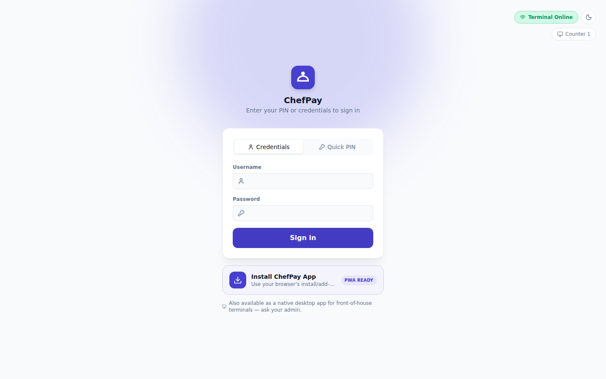

Every session starts here. Staff sign in either with a username and password ("Credentials") or with a short numeric PIN ("Quick PIN") — the PIN mode is the fast path for a busy counter where a cashier or waiter just needs to punch in a code and get back to serving. The top of the screen also shows the terminal's own identity and connection state: a "Terminal Online" badge confirms the device has a working connection, and a "Counter 1" chip shows which registered terminal this browser is acting as.

Before a device can be used for billing, it has to be registered once as a Terminal under a Branch — this is a one-time setup step done by an admin or manager, not something staff repeat at every shift. Once registered, the terminal remembers its identity (its terminal code) so that every order, kitchen ticket, or payment it produces is automatically tagged with the correct branch and device. This matters for a multi-branch chain: it means the owner can always answer "which physical till, at which location, rang up this bill" without any manual tagging by staff. The login screen also offers to install ChefPay as an app on the device (it is installable as a Progressive Web App) and notes that a native desktop app is available for front-of-house terminals as well.

## Dashboard

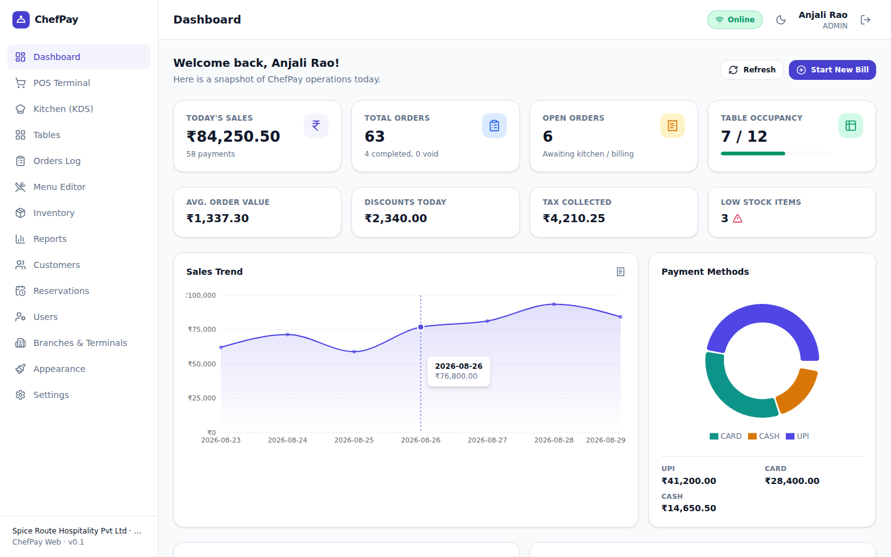

The Dashboard is the owner's or manager's morning-coffee screen — a snapshot of how the restaurant (or the signed-in branch) is doing right now. It leads with today's total sales and how many payments made up that figure, the total number of orders placed today (and how many are completed versus voided), how many orders are still open and awaiting the kitchen or billing, and current table occupancy shown as a fraction (e.g. how many of the branch's tables are occupied) with a progress bar. Below that sit four more figures at a glance: the average value of an order today, the total discounts given away today, the tax collected today, and a count of items currently running low on stock, flagged with a warning so it cannot be missed.

The lower half of the Dashboard adds two visual reports: a sales trend line chart across the last several days (hovering a point shows the exact date and revenue), and a payment-method breakdown shown as a donut chart splitting today's revenue across cash, card, and UPI, with the exact rupee figure for each method listed underneath. Together these give a manager everything needed to sanity-check a shift or a day without digging into detailed reports, and a prominent "Start New Bill" button sits ready to jump straight into the POS Terminal. This screen is primarily for owners, managers, and admins rather than front-line cashier or kitchen staff.

## POS Terminal

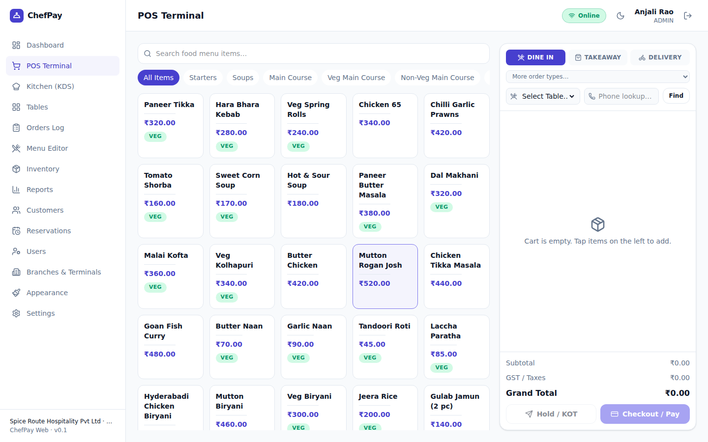

This is the screen where the actual business of the restaurant happens: taking an order and turning it into a paid bill. The left and center of the screen present the live menu as a searchable grid of items grouped by category (Starters, Soups, Main Course, and its Veg/Non-Veg subcategories, and so on), each item showing its price and, where relevant, a veg/non-veg indicator. A cashier or waiter searches or taps through categories, taps items to add them to the order, and the right-hand panel builds up the running cart in real time — showing dining type (Dine In, Takeaway, Delivery, with more order types available from a dropdown), table selection, an optional customer phone lookup, and a live subtotal, tax (GST), and grand total.

Once items are added, staff can either "Hold / KOT" the order — which sends it through to the kitchen as a Kitchen Order Ticket without taking payment yet, the normal flow for dine-in — or go straight to "Checkout / Pay" for something like a quick takeaway sale. At checkout, the cashier collects payment by cash, card, or UPI, and can then produce a receipt for the customer by printing it, emailing it, or sending it via WhatsApp. The layout is built to work as well on a tablet or phone as on a full-size till — on a narrow screen the cart panel behaves as a bottom sheet that a waiter can pull up over the menu — which is what lets the same screen serve a counter cashier and a waiter taking orders tableside. This is the primary daily-use screen for cashiers and waiters.

## Kitchen (KDS)

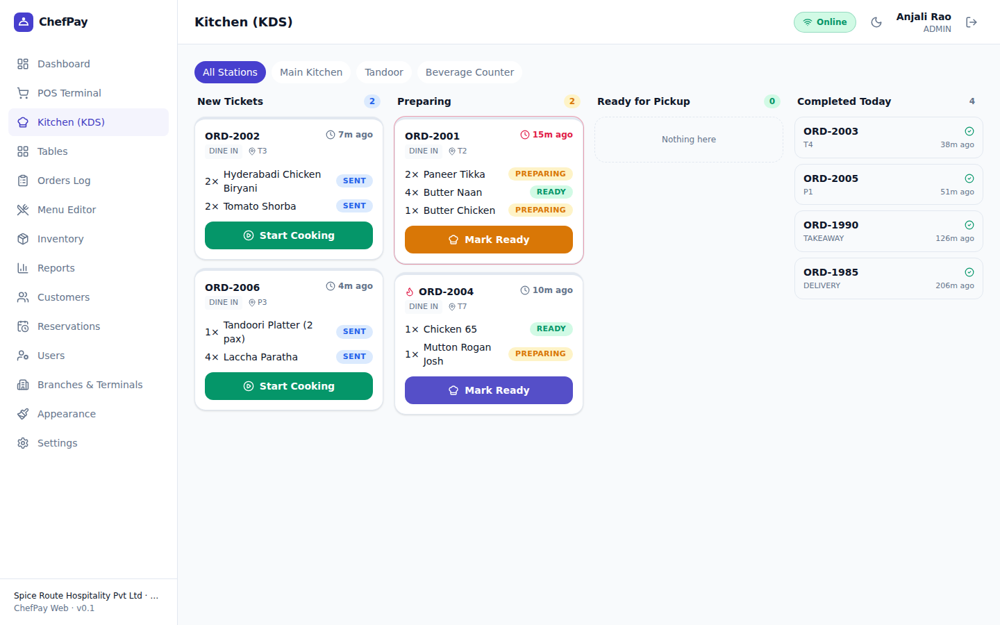

The Kitchen Display Screen is where an order sent from the POS Terminal turns into something the kitchen actually cooks. Tickets appear as cards organized into columns by stage — New Tickets, Preparing, Ready for Pickup, and Completed Today — and can be filtered by station (the screenshot shows All Stations, Main Kitchen, Tandoor, and Beverage Counter), so a restaurant with separate kitchen sections can route tickets to the right screen. Each ticket lists the table or order type, how long ago it came in, and every item on it with its own status (Sent, Preparing, Ready); kitchen staff move a whole ticket forward with a single tap — "Start Cooking" moves it into Preparing, "Mark Ready" moves it to Ready for Pickup — and individual items on a ticket can show mixed progress before the whole ticket is called ready.

This screen is used by kitchen staff (chefs and cooks), and it plugs directly into whether front-of-house is allowed to close out an order. A restaurant can choose, in Settings, whether an order must be genuinely progressed through the kitchen screen before it can be marked "Served" at the till — enforcing that food actually left the kitchen before a table is billed — or whether to allow a manual override so a simpler kitchen (or one without a dedicated KDS in use) isn't blocked by the extra step. That choice is a configuration decision for the owner or manager to make based on how disciplined they want the kitchen workflow to be.

## Tables

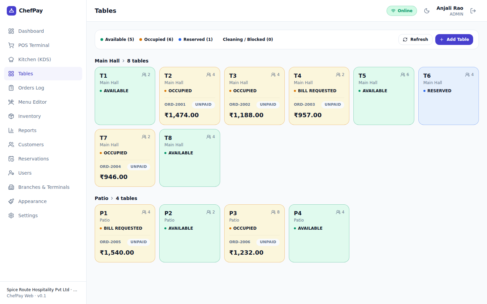

The Tables screen is the floor plan in list form, organized by seating area (the screenshots show a "Main Hall" with eight tables and a "Patio" with four). A summary bar at the top gives the count of tables that are Available, Occupied, Reserved, and Cleaning/Blocked at a glance. Each table tile shows its seating capacity, its current status, and — if it's occupied — which order is running against it, whether that order is still unpaid, and the current bill total, so a manager can see exposure across the whole floor without opening every order individually.

This is the screen that connects the floor to the till: when a waiter or cashier picks a table in the POS Terminal, it is this table inventory they are selecting from, and a table's status flips automatically as an order is opened, moves to "Bill Requested," and is eventually paid and cleared. It solves the everyday problem of knowing, at a glance, which tables are free to seat a new party and which are mid-meal or waiting on their check — used continuously by waiters, hosts, and managers during service.

## Orders Log

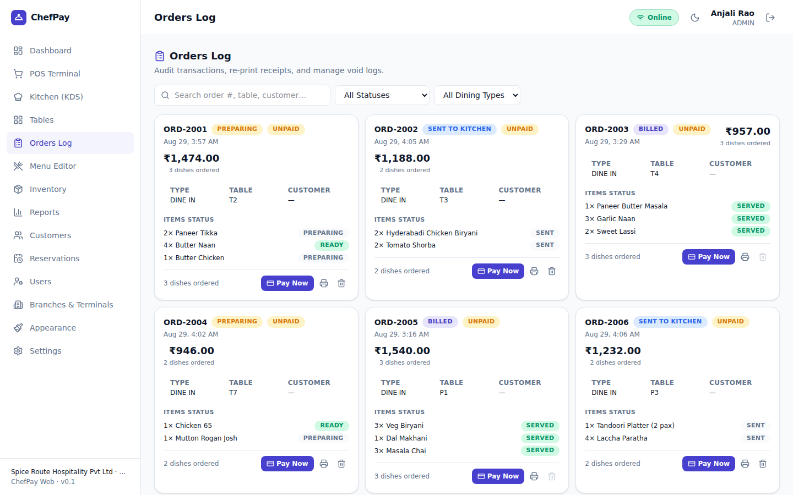

Orders Log is the audit trail for the day (or any past day): every order that has been created, in one searchable, filterable list. Each card shows the order number, its current status (Preparing, Sent to Kitchen, Billed, and so on) alongside its payment status (Unpaid/paid), the order total, when it was placed, its dining type and table, the customer if one was attached, and a line-by-line breakdown of items with each item's own kitchen status. Searches can be run by order number, table, or customer, and results can be narrowed by status or dining type.

From here staff can jump straight to payment ("Pay Now") on an order that's still unpaid, re-print a receipt, or void/delete an order if needed. This is the screen a manager or admin reaches for when reconciling the day, answering a customer question about a past order, or investigating a discrepancy — it is the single place that shows exactly what happened, in what order, across every order the restaurant has taken.

## Menu Editor

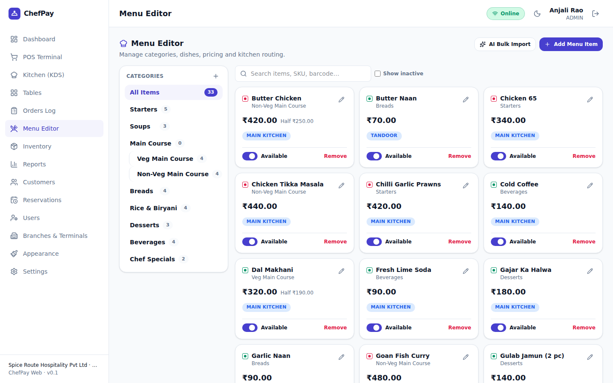

The Menu Editor is where the restaurant's sellable catalog lives — every category, subcategory, dish, price, tax treatment, and availability toggle that the POS Terminal draws from. Categories are shown down the left side with running item counts (Starters, Soups, Breads, Rice & Biryani, Desserts, Beverages, Chef Specials) and support one level of subcategory nesting — the screenshot shows "Main Course" split into "Veg Main Course" and "Non-Veg Main Course," which is exactly the kind of grouping a restaurant needs to keep a long menu navigable both here and on the POS screen. Each item card shows its name, category, price (and a half-portion price where offered), which kitchen station it routes to (Main Kitchen, Tandoor, and so on), a veg/non-veg indicator, and an Available toggle to pull an item off the active menu without deleting it — along with edit and remove controls, and a search box that can look items up by name, SKU, or barcode.

Beyond manual entry ("Add Menu Item"), the Menu Editor includes an AI-powered "Bulk Import" wizard: the owner or manager photographs a physical or printed menu, and the system reads the photo and drafts a full set of categories and items — names, prices, groupings — as a proposal, without saving anything automatically. The owner reviews and edits that draft before anything goes live, which matters both for accuracy and for catalog hygiene: the review step includes a category-matching pass that checks whether an item's suggested category already exists on the menu and reuses it instead of creating a near-duplicate (for example, avoiding a second "Starters" category alongside an existing one), and the editor separately provides the ability to delete an empty or duplicate category, or merge two categories together, so the catalog stays clean even as it's built up over time. This is the fastest way for a new restaurant to get its whole menu into ChefPay without retyping it dish by dish. This screen is used by owners, managers, or whoever is designated to own menu and pricing changes.

## Inventory

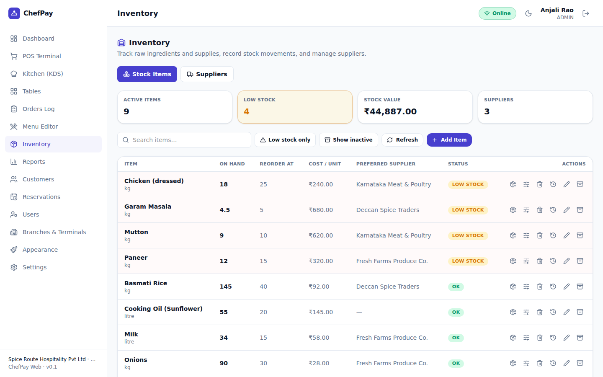

Inventory tracks the raw ingredients and supplies behind the menu, separate from the sellable items themselves. The Stock Items view lists each ingredient with how much is currently on hand, the reorder threshold at which it should be restocked, cost per unit, its preferred supplier, and a status flag — the screenshot shows several items (chicken, garam masala, mutton, paneer) already flagged "Low Stock" against items sitting comfortably "OK" (rice, oil, milk, onions), with summary tiles up top for active items, how many are low on stock, total stock value, and number of suppliers on file. A Suppliers tab (alongside Stock Items) manages the vendor side of the same picture.

Stock levels here are tied to sales: as dishes are sold through the POS Terminal, the ingredients that go into them are deducted from stock automatically, so the low-stock picture reflects real consumption rather than requiring a manual count after every service. The Dashboard's "Low Stock Items" figure is fed by this same data. This module is mainly for managers or whoever handles purchasing, and it exists to prevent the two classic inventory failures: running out of a key ingredient mid-service, and over-ordering because nobody had a current picture of what was actually on the shelf.

## Reports

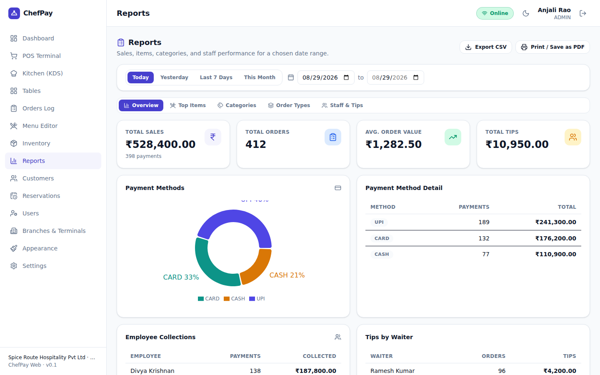

Reports is where the Dashboard's daily snapshot turns into a proper business review over any date range — quick presets for Today, Yesterday, Last 7 Days, and This Month, or a custom start and end date. The Overview tab shows total sales, total orders, average order value, and total tips for the selected period, alongside a payment-method donut chart and a detail table breaking down payments and rupee totals by cash, card, and UPI, plus per-employee collection totals and per-waiter tip totals. Additional tabs — Top Items, Categories, Order Types, and Staff & Tips — slice the same period by what sold best, which categories performed, how business split across dine-in/takeaway/delivery, and how individual staff performed.

Every report can be exported as a CSV file for further analysis in a spreadsheet, or printed/saved as a PDF for record-keeping or sharing with an accountant or a co-owner. This is the module an owner reaches for at the end of a week or month to understand trends, staff performance, and where revenue is actually coming from, rather than just how business is doing right this minute.

## Customers

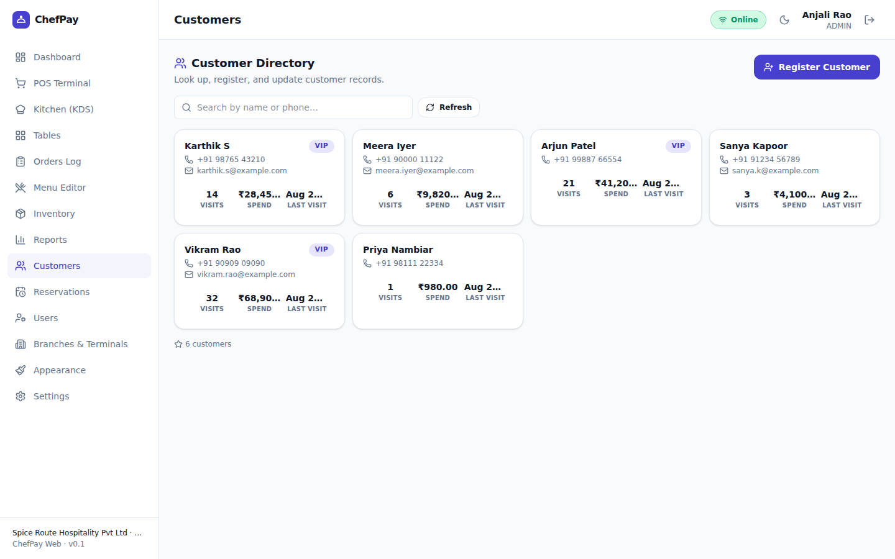

The Customer Directory is a simple record of who has been eating at the restaurant: each customer card shows their name, phone number and email, a VIP flag for standout regulars, how many times they've visited, their total lifetime spend, and their last visit date. Records can be searched by name or phone, and new customers can be registered directly from this screen — the same phone-number lookup also appears inside the POS Terminal, letting a cashier attach a returning customer to their order at the point of sale rather than as a separate step.

This module exists to support repeat-customer recognition and lightweight marketing: knowing that a phone number belongs to a 32-visit VIP, versus a first-time walk-in, is useful both for service (recognizing a regular) and for outreach (knowing who's worth a promotional message). It is typically used by managers or front-of-house staff who interact with customers directly.

## Reservations

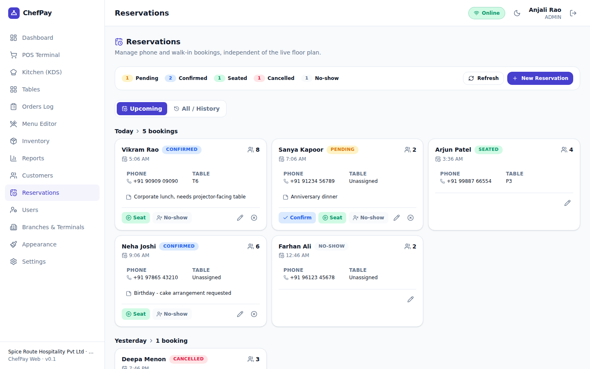

Reservations manages phone and walk-in bookings independently of the live floor plan — it is the "who's coming in later" list rather than the "who's sitting where right now" list that Tables handles. A status summary shows counts of bookings that are Pending, Confirmed, Seated, Cancelled, and No-show, and each booking card shows the guest's name, party size, requested time, phone number, assigned table (if one has been set), and any notes staff attached (the screenshots show notes like "needs a projector-facing table" or "birthday — cake arrangement requested"). Bookings can be viewed as Upcoming or across All/History.

From a booking card, staff can confirm a pending reservation, seat the party (which is presumably where it connects into the Tables view once seated), or mark a no-show, and can create a brand-new reservation with the same details. This is used by hosts, managers, or whoever answers the phone to take bookings, and it solves the problem of double-booked tables and forgotten phone reservations by giving the whole front-of-house team one shared, current list of who is expected.

## Users

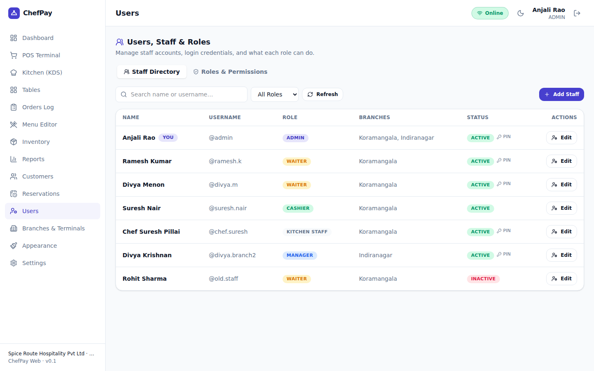

Users is where staff accounts and permissions are managed. The Staff Directory lists every team member with their display name, username, assigned role (Admin, Manager, Cashier, Waiter, Kitchen Staff, and so on), which branch or branches they're attached to, whether their account is Active or Inactive, and whether they have a PIN set for quick sign-in — each row supports resetting their PIN and editing their details, and new staff can be added directly from here. A separate Roles & Permissions tab governs what each role is actually allowed to do.

The point of role-based permissions is that each person only sees, and can only do, what their job requires: a waiter needs the POS Terminal and Tables but has no business in Settings or Reports; kitchen staff need the KDS and nothing else; a cashier needs billing and payments; a manager needs broader operational visibility; and only an Admin needs the full run of the system, including staff management itself. This keeps the system safe to hand to a large team without every employee having access to sensitive configuration, financial reports, or the ability to change other people's accounts. This screen itself is naturally restricted to Admins and Managers.

## Branches & Terminals

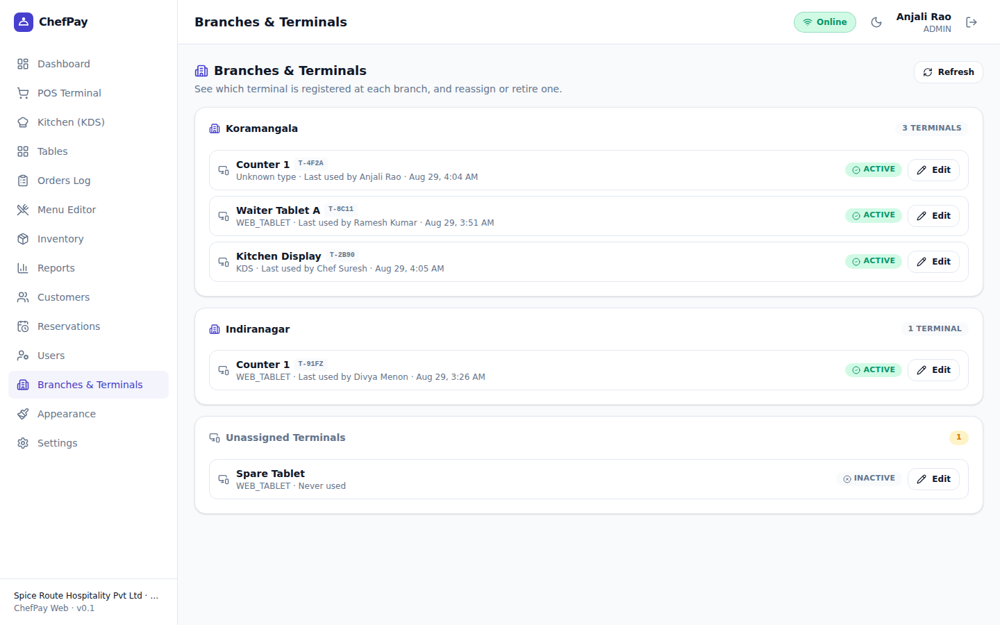

For a restaurant operating more than one location, Branches & Terminals is the control center for the whole physical estate. Branches are listed with every terminal registered under them — the screenshot shows a "Koramangala" branch with three terminals (a counter till, a waiter tablet, and a kitchen display) and an "Indiranagar" branch with one — and each terminal shows its short terminal code, its type, who last used it, and when. A terminal that hasn't yet been assigned to a branch (for example a spare tablet that's been set up but not put into service) shows up under "Unassigned Terminals" as Inactive, ready to be assigned when needed; each terminal can be edited or reassigned from here.

This is the screen an owner or admin running a multi-branch operation uses to answer "what hardware do we actually have running, and where," to retire a lost or replaced device, or to bring a new terminal online at a new location — the same registration concept introduced back at Login & Terminal Setup, managed here across the whole organization rather than one device at a time.

## Settings

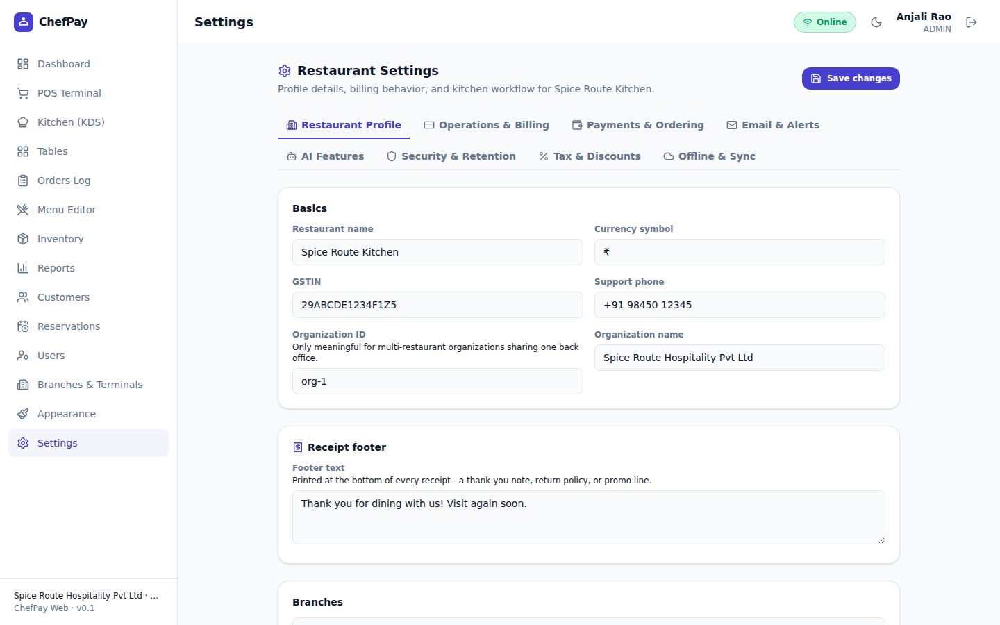

Settings is the restaurant's control panel, organized into tabs: Restaurant Profile, Operations & Billing, Payments & Ordering, Email & Alerts, AI Features, Security & Retention, Tax & Discounts, and Offline & Sync. Restaurant Profile holds the basics — restaurant name, currency symbol, GSTIN, support phone, and for a multi-restaurant back office, an organization ID and organization name — plus the receipt footer text that prints on every customer receipt (a thank-you note, return policy, or promotional line), and the list of branches under this organization.

The other tabs, in business terms, cover: Operations & Billing for day-to-day billing behavior and kitchen workflow rules (including the kitchen-confirmation-before-serving choice described under Kitchen (KDS) above); Payments & Ordering for which payment methods (cash/card/UPI) and order types are enabled; Email & Alerts for the SMTP configuration needed to actually send emailed receipts and notifications; Tax & Discounts for how tax and discounts are calculated and applied; Security & Retention for account security and how long data is kept; Offline & Sync for the offline behavior and backup panel described in the next section; and AI Features for turning on the optional AI capabilities described below, choosing an AI provider, and supplying that provider's API key. A logo/branding option is also available under Appearance in the main navigation. This whole area is intended for Admins (and, for narrower tabs, Managers) rather than day-to-day operating staff.

## Offline-first behavior

ChefPay is built to keep working when the internet, or the connection to the server, drops — a real and frequent condition in many restaurant environments. If connectivity is lost, a terminal continues to take orders and process billing entirely locally; nothing about service has to stop. The moment the connection is restored, everything queued during the outage is synced automatically to the server. Every screen carries a small connection-status indicator (visible in the top-right corner of every screenshot in this guide, showing "Online" or a terminal-online badge) so staff always know at a glance whether they're currently connected or running offline, and the Offline & Sync tab in Settings adds a manual "sync now" option for forcing a sync rather than waiting for it to happen automatically, plus a JSON-based backup and restore feature for the terminal's local data — a safety net independent of network sync. This matters most for cashiers and managers, who need to trust that a spotty connection will never mean a lost sale or a stuck till.

## AI features

ChefPay includes a set of optional AI-assisted features, all switched off by default and only usable once the restaurant supplies its own AI provider API key in Settings → AI Features. None of them are required to run the restaurant day to day; they exist to save time on specific tasks:

- Menu setup from a photo — the AI Bulk Import wizard in the Menu Editor, described above, that drafts categories and items from a photo of a menu for the owner to review before saving.
- "Ask your data" — a chat-style question-and-answer feature over the restaurant's own sales data, letting an owner or manager ask plain-language questions instead of building a report manually.
- Smart supplier-reorder suggestions — draft purchase-order suggestions for the Inventory module, based on stock levels and reorder points, for a manager to review and approve rather than build from scratch.
- Unusual-activity flagging — an audit-anomaly detector that surfaces order or billing activity that looks out of the ordinary, as a prompt for a manager to look closer.
- AI-written menu item descriptions — drafts a description for a menu item in the Menu Editor, saving the owner from writing marketing copy for every dish.
- Nightly business summary — an automatic, AI-written recap of the day's business, delivered each night into the in-app notification inbox described below, so an owner can catch up on how the day went without opening the Dashboard or Reports.

Because every one of these is optional and requires the restaurant's own API key, a restaurant that prefers not to use AI at all — or isn't ready to — runs ChefPay exactly the same way without them.

## Notifications & receipts

An in-app notification inbox collects system messages for staff to review — the nightly AI business summary described above lands here, for instance. Receipts, wherever they're generated (mainly from the POS Terminal and Orders Log), can be delivered three ways: printed directly from the terminal, emailed to the customer (which requires SMTP to be configured under Settings → Email & Alerts), or sent via WhatsApp — which opens WhatsApp with the receipt text already filled in, ready to send, and needs no WhatsApp Business account or special integration to work. Between these three options, a restaurant can offer whichever receipt format suits its customers without extra hardware or accounts beyond what a phone or printer already provides.

## Where to go next

This guide deliberately stays at the level of screens and workflows. For how ChefPay is actually built — the server, the database, the real-time messaging behind the Kitchen Display and Tables screens, and how offline sync is implemented — see [`TECHNICAL_GUIDE.md`](./TECHNICAL_GUIDE.md). For how to set up a development workspace, build the deployable server JAR, choose a production database, scale for a larger client, and deploy step by step to Oracle Cloud, see [`DEPLOYMENT_GUIDE.md`](./DEPLOYMENT_GUIDE.md). For the full table-by-table data model, see [`DATA_DICTIONARY.md`](./DATA_DICTIONARY.md).
