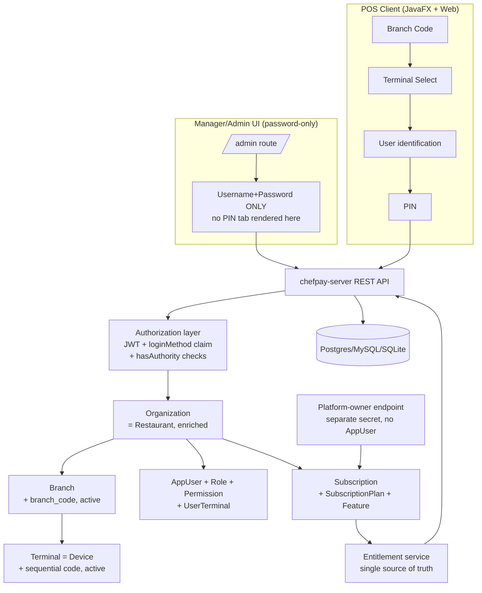

# ChefPay Phase 2 — Organization → Branch → Terminal → Users/Roles → Login → Subscription/Licensing

Design document requested before implementation begins. Covers items 1–39 of the request: the
three immediate bug fixes (already implemented — see the note at the very end), and the full
Organization/Branch/Terminal/User/Role/Login/Subscription architecture (items 4–39).

**Hosting-model decision (confirmed with you before writing this):** one ChefPay server + database
per restaurant business, same as today — not one shared server hosting many unrelated restaurants.
Every section below is designed against that decision. It matters because it changes what
"Organization" means here: it is **not** a new multi-tenant root that many unrelated businesses
share a database under. It is the existing `Restaurant` row, enriched — the one business this
particular install belongs to — with Branches, Terminals, Users, and a Subscription all hanging off
it exactly as they do today, just with real CRUD, real ID generation, and a real licensing layer
where none exists yet.

---

## A. Gap Analysis

### What already exists and can be reused as-is

- **`Restaurant`** already functions as the Organization root (Round 17 added `organizationId`/
  `organizationName`), and already has `gstin`, `supportPhone`, and dozens of other config fields.
  It does not yet have a structured address, a general contact email, a status flag, or any
  subscription linkage — all additive.
- **`Branch`** already exists (`ManyToOne` to `Restaurant`, has `name`/`address`/`phone`) but has no
  short human-facing code (e.g. "1100"), no `active` flag, and — importantly — **no CRUD API at
  all**. Branches today can only be created indirectly (there's no `BranchController`); the only
  branch-adjacent screen (`BranchesTerminalsPage.tsx`) manages Terminals, not Branches themselves.
- **`Device`** already **is** the Terminal entity (this was the Round 17 decision, and it's still
  the right call — a Device already means "one registered POS/kitchen/tablet client instance").
  It already has `branch`, `terminalCode`, and `active`. It's missing: sequential per-branch
  numbering ("001", "002"…) — today's `terminalCode` is a random short code like `T-4F2A` — and a
  bulk-create ("how many terminals do you want?") endpoint.
- **`AppUser`/`Role`/`Permission`** are already exactly the granular, backend-enforced,
  data-driven RBAC model item 8 asks for: `Role` has a `Set<Permission>` via a join table,
  `Permission` is a plain `code` + description seeded as data, and every controller method already
  gates on `@PreAuthorize("hasAuthority('X')")`. Seed roles today: `ADMIN`, `MANAGER`, `CASHIER`,
  `WAITER`, `KITCHEN`, `VIEW_ONLY` — no `OWNER`. **This is most of item 8 already built** — the gap
  is narrow (add an `OWNER` role, add a handful of new permission codes for the new screens).
- **`AppUser.branches`** (`ManyToMany` via `app_user_branch`) already implements per-user
  branch restriction, empty set = unrestricted (backward compatible). There is **no** per-terminal
  restriction today (item 14's "Terminal 001 and 002 but not others") — new.
- **PINs are already BCrypt-hashed** (`AppUser.pinHash`) — item 9's "must not be stored as plain
  text" is already satisfied. Nothing to change there.
- **`AuditLog`** already exists, and is more sophisticated than a plain table — Round 13 added a
  tamper-evident hash chain (`chainSeq`/`entryHash`/`prevHash`). Reuse directly; just add new action
  strings for the new object types.
- **The offline-first sync engine** (Round 17, IndexedDB + a background sync worker) already
  establishes the exact pattern item 29 (offline subscription grace period) needs: a cached
  last-known-good value + a last-validated timestamp + revalidation on reconnect. New entitlement
  caching should copy this pattern, not invent a new one.
- **The Manager/Admin UI does not exist as a separate application** — it's the same React web app,
  gated per-screen by permission. Today's single login screen (`LoginPage.tsx`) offers both
  "Username & Password" and "Quick PIN" tabs to everyone, with no distinction between a POS login
  and an administrative one. Item 4.1 needs a real separation here.

### What is a genuine, confirmed, currently-live bug (not a gap — a defect)

**PIN login is ambiguous today, exactly as item 10 describes**, and I found the exact code:
`UserAccountService.verifyPin(String pin)` does a **linear scan of every active user, BCrypt-checks
the PIN against each, and returns the first match** (`.findFirst()`). Nothing anywhere enforces PIN
uniqueness — two cashiers can be given PIN `1234` today and the system will silently log in
whichever one happens to come first in an arbitrary in-memory ordering. This is not a hypothetical
risk the request is asking me to prevent — it is already live, already possible, and already silent.
It needs the branch → terminal → user-identification → PIN flow item 11 asks for, not a patch.

### What is 100% new (no code, no entities, nothing to extend)

- **Everything in items 16–28** — Subscription, SubscriptionPlan, Feature/entitlement, plan pricing,
  trial duration, expiry/grace-period states, the "platform owner" backend. A repo-wide search
  confirms zero existing references to "Subscription," "License," or "Plan" as a licensing concept
  anywhere in the domain model.
- **`Branch`/`Terminal` bulk-create-with-a-count workflow** (items 6–7).
- **The redesigned first-run client flow** (branch code → terminal → user → PIN, items 11–13).
- **Per-terminal user restriction** (item 14).
- **The Manager/Admin-only, password-only authentication boundary** (item 4.1).

### Potential architectural conflicts to resolve now, explicitly, rather than guess at

1. **Where does the "platform owner" (you, as the ChefPay company) authenticate, if every
   deployment is a separate, private install?** There is no shared central server to log into.
   *Recommendation:* a `PlatformOwnerController`, gated by a **separate secret** (an environment
   variable, e.g. `CHEFPAY_PLATFORM_OWNER_KEY`, configured per install — not tied to any `AppUser`/
   `Role`/permission at all). This makes it provably impossible for a restaurant's own Admin,
   however powerful, to ever reach it — it isn't a permission that could accidentally be granted; a
   completely different credential is required, one only you hold, generated when you deploy each
   client's install. You'd log into `/platform/...` on that specific client's URL with that secret
   when you need to change their plan. This keeps the "one deployment per business" model intact
   while still giving you a centralized-feeling control point over each install's licensing.
2. **`OWNER` vs `ADMIN`.** Today's top role is `ADMIN`. Adding a distinct `OWNER` role above it (full
   access, including subscription visibility per item 26, and the only role that can never be
   deactivated by another user) is a clean, additive change — seed one more row, no migration risk.
3. **Existing single-branch installs must keep working unmodified.** Every new restriction (branch
   codes, per-terminal access, mandatory branch/terminal selection at login) must degrade to
   today's exact behavior when only one branch/terminal exists — this repo has a strong, consistent
   precedent for that (`AppUser.branches` empty-set-means-unrestricted; `LoginResponse.branches`
   with 2+ entries triggers a picker, else auto-selects). The new flow follows the same rule:
   **a single-branch, single-terminal restaurant never sees an extra screen.**

### Database migration requirements

New Flyway migration(s) starting at `V28` (`V27` is the current highest). Additive only —
new nullable columns, new tables, no destructive changes — so every existing row keeps working
through the migration with no manual data fix-up required. Full column/table list in Section C.

---

## B. Proposed Architecture



Layering, top to bottom, each depending only on the layer below it:

1. **Manager/Admin UI** — a distinct route (`/admin`, reusing the existing React app rather than a
   second build — see Section E) that renders only the Username+Password form, never the PIN tab.
2. **POS Client** — both JavaFX and the web POS terminal get the new first-run flow. Both already
   share one backend contract; this phase keeps that true rather than letting them diverge (the
   JavaFX "Failed to parse server response" bug you just hit was exactly the two clients silently
   drifting apart — the redesigned login DTOs get shared field-for-field between both from day one
   this time).
3. **Authorization layer** — JWT gains one new claim, `loginMethod: PASSWORD|PIN`. A new
   `@PreAuthorize`-compatible check (`hasAuthority('...') and @auth.isPasswordLogin()`, or an
   equivalent custom annotation) gates every Organization/Branch/Terminal/User/Role/Subscription
   management endpoint so a PIN-authenticated session can never reach them — enforced at the API,
   not just by which screen the client shows.
4. **Organization / Branch / Terminal** — enrich existing entities, add the missing CRUD.
5. **Users / Roles / Permissions / UserTerminal** — extend existing model with per-terminal scoping.
6. **Subscription / Plan / Feature (Entitlement service)** — new. A single service
   (`EntitlementService`) is the **only** place that answers "is feature X available right now" —
   every feature-gated screen and endpoint asks it, never re-implements the plan/date/grace-period
   logic itself. This mirrors how `AiService`/`EmailReceiptService` are already the single gate for
   their respective features — same established pattern, new subject matter.
7. **Platform-owner endpoint** — sits beside, not inside, the restaurant's own auth system; the one
   place allowed to write `Subscription` rows.

---

## C. Database Changes

All additive. New migration `V28__phase2_organization_branch_terminal.sql`, then
`V29__phase2_subscription_licensing.sql`, then `V30__phase2_audit_actions.sql` (a comment-only /
seed-data migration — audit actions are just strings, no schema change needed for them).

### `V28` — Organization, Branch, Terminal, Users/Roles hardening

```sql
-- Organization (Restaurant enriched) -----------------------------------------------------------
ALTER TABLE restaurant ADD COLUMN contact_email VARCHAR(255);
ALTER TABLE restaurant ADD COLUMN address_line1 VARCHAR(255);
ALTER TABLE restaurant ADD COLUMN address_line2 VARCHAR(255);
ALTER TABLE restaurant ADD COLUMN city VARCHAR(100);
ALTER TABLE restaurant ADD COLUMN state VARCHAR(100);
ALTER TABLE restaurant ADD COLUMN postal_code VARCHAR(20);
ALTER TABLE restaurant ADD COLUMN country VARCHAR(100);
ALTER TABLE restaurant ADD COLUMN status VARCHAR(20) NOT NULL DEFAULT 'ACTIVE'; -- ACTIVE|SUSPENDED|CLOSED
-- gstin already exists (Tax/GST requirement already satisfied)

-- Branch ----------------------------------------------------------------------------------------
ALTER TABLE branch ADD COLUMN branch_code VARCHAR(20);           -- e.g. "1100", system-generated
ALTER TABLE branch ADD COLUMN active BOOLEAN NOT NULL DEFAULT true;
CREATE UNIQUE INDEX ux_branch_code ON branch (branch_code);      -- unique once populated

-- Terminal (Device) ------------------------------------------------------------------------------
ALTER TABLE device ADD COLUMN sequence_no INT;   -- 1, 2, 3... scoped to its branch, drives "Terminal 00N"
CREATE UNIQUE INDEX ux_device_branch_sequence ON device (branch_id, sequence_no);

-- Roles -------------------------------------------------------------------------------------------
INSERT INTO app_role (id, name, description, version, created_at, updated_at)
VALUES (<uuid>, 'OWNER', 'Full access; the only role that cannot be deactivated by another user', 0, now(), now());
-- OWNER granted every existing permission code plus the new SUBSCRIPTION_MANAGE (below)

-- Per-terminal user restriction --------------------------------------------------------------------
CREATE TABLE app_user_terminal (
    app_user_id CHAR(36) NOT NULL REFERENCES app_user(id),
    device_id   CHAR(36) NOT NULL REFERENCES device(id),
    PRIMARY KEY (app_user_id, device_id)
);
-- Empty = unrestricted (every branch's every terminal), matching app_user_branch's existing convention.

-- New permission codes -------------------------------------------------------------------------
INSERT INTO permission (id, code, description, version, created_at, updated_at) VALUES
  (<uuid>, 'ORGANIZATION_MANAGE', 'Edit organization profile/contact/tax details', 0, now(), now()),
  (<uuid>, 'BRANCH_MANAGE',        'Create/edit/activate/deactivate branches', 0, now(), now()), -- reuse if it already exists, see note below
  (<uuid>, 'TERMINAL_MANAGE',      'Create/edit/decommission terminals', 0, now(), now()),
  (<uuid>, 'SUBSCRIPTION_MANAGE',  'View/renew subscription, visible per role', 0, now(), now()),
  (<uuid>, 'ROLE_MANAGE',          'Edit role permission grants', 0, now(), now()); -- reuse if present
```

*(`BRANCH_MANAGE`/`ROLE_MANAGE` may already exist as permission codes — `UserController` already
references `hasAuthority('BRANCH_MANAGE')`. The actual migration script will `SELECT` first and only
insert what's missing, rather than assume.)*

### `V29` — Subscription / Licensing

```sql
CREATE TABLE subscription_plan (
    id CHAR(36) PRIMARY KEY,
    name VARCHAR(100) NOT NULL,
    description VARCHAR(500),
    duration_days INT NOT NULL,             -- 30/60/90/180/365... fully configurable
    price DECIMAL(12,2) NOT NULL DEFAULT 0,
    gst_percent DECIMAL(5,2) NOT NULL DEFAULT 0,
    max_branches INT,                        -- null = unlimited
    max_terminals INT,
    max_users INT,
    is_trial BOOLEAN NOT NULL DEFAULT false,
    active BOOLEAN NOT NULL DEFAULT true,
    display_order INT NOT NULL DEFAULT 0,
    version BIGINT NOT NULL DEFAULT 0, created_at TIMESTAMP NOT NULL, updated_at TIMESTAMP NOT NULL
);

CREATE TABLE feature (
    id CHAR(36) PRIMARY KEY,
    code VARCHAR(64) NOT NULL UNIQUE,        -- e.g. "ADVANCED_REPORTS", "INVENTORY", "MULTI_BRANCH"
    description VARCHAR(255),
    version BIGINT NOT NULL DEFAULT 0, created_at TIMESTAMP NOT NULL, updated_at TIMESTAMP NOT NULL
);

CREATE TABLE plan_feature (
    subscription_plan_id CHAR(36) NOT NULL REFERENCES subscription_plan(id),
    feature_id            CHAR(36) NOT NULL REFERENCES feature(id),
    PRIMARY KEY (subscription_plan_id, feature_id)
);
-- A feature row present here = enabled for that plan. Absent = disabled. No per-feature boolean
-- column needed - presence/absence in this join table IS the entitlement, same "a row means yes"
-- convention app_user_branch already uses.

CREATE TABLE subscription (
    id CHAR(36) PRIMARY KEY,
    restaurant_id CHAR(36) NOT NULL UNIQUE REFERENCES restaurant(id), -- one per organization/install
    subscription_plan_id CHAR(36) NOT NULL REFERENCES subscription_plan(id),
    status VARCHAR(20) NOT NULL,             -- ACTIVE|EXPIRING_SOON|GRACE_PERIOD|EXPIRED|SUSPENDED
    start_date DATE NOT NULL,
    expiry_date DATE NOT NULL,
    grace_period_days INT NOT NULL DEFAULT 0,
    warning_thresholds_days VARCHAR(100) NOT NULL DEFAULT '30,15,7,3,1', -- CSV, configurable
    support_phone VARCHAR(32),                -- configurable "call for renewal" number, per install
    last_offline_validated_at TIMESTAMP,       -- item 29's offline-cache validation timestamp
    version BIGINT NOT NULL DEFAULT 0, created_at TIMESTAMP NOT NULL, updated_at TIMESTAMP NOT NULL
);

INSERT INTO permission (...) VALUES (<uuid>, 'SUBSCRIPTION_VIEW', 'View own subscription/plan screen', ...);
```

*Deliberately no `Tenant`/multi-org table here* — per the confirmed hosting model, `subscription` has
exactly one row per install (enforced by the `UNIQUE` on `restaurant_id`), not one row per
"organization" in a shared multi-tenant sense.

### `V30` — Audit action catalogue (data-only, no schema change)

`AuditLog` already accepts an arbitrary action string; this migration just documents (in a comment,
and in `TECHNICAL_GUIDE.md`) the new action strings so they're consistent across every new
controller: `ORGANIZATION_UPDATED`, `BRANCH_CREATED`, `BRANCH_UPDATED`, `BRANCH_DEACTIVATED`,
`TERMINAL_CREATED`, `TERMINAL_UPDATED`, `TERMINAL_DECOMMISSIONED`, `USER_PIN_CHANGED`,
`USER_ROLE_CHANGED`, `SUBSCRIPTION_CREATED`, `SUBSCRIPTION_RENEWED`, `SUBSCRIPTION_EXPIRED`,
`SUBSCRIPTION_PLAN_CHANGED`, `FEATURE_ENTITLEMENT_CHANGED`. Never logs a raw PIN/password — only the
fact that it changed and who changed it, matching every existing audit call site's convention.

---

## D. API Changes

All new endpoints follow the existing `ApiResponse<T>` envelope and `@PreAuthorize` convention.
**PW** marks an endpoint that also requires `loginMethod = PASSWORD` (rejects a PIN-only session
regardless of permissions) — the server-side half of item 4.1's enforcement.

| Endpoint | Purpose | Auth |
|---|---|---|
| `PATCH /api/organization` | Edit org profile/contact/tax/address | `ORGANIZATION_MANAGE`, **PW** |
| `GET /api/organization` | Read org profile (already partly exists via `RestaurantController`) | any authenticated |
| `POST /api/branches` | Create branch, auto-generates `branch_code` | `BRANCH_MANAGE`, **PW** |
| `GET /api/branches` | List branches (extends today's terminal-only screen) | `BRANCH_MANAGE` or `USER_MANAGE` |
| `PATCH /api/branches/{id}` | Edit / activate / deactivate | `BRANCH_MANAGE`, **PW** |
| `DELETE /api/branches/{id}` | Hard-delete only if provably empty (no terminals, no orders) — else 409 with a clear message, same convention as category delete | `BRANCH_MANAGE`, **PW** |
| `GET /api/branches/by-code/{code}` | **Public** (no auth) branch-code validation for the client's first-run screen — returns only `{branchId, branchName, active}`, nothing sensitive | none (rate-limited) |
| `POST /api/branches/{id}/terminals:bulk` | "How many terminals?" → creates N sequentially-numbered terminals | `TERMINAL_MANAGE`, **PW** |
| `POST /api/branches/{id}/terminals` | Create one more terminal | `TERMINAL_MANAGE`, **PW** |
| `PATCH /api/terminals/{id}` | Rename / activate / deactivate / decommission (extends existing `TerminalController`) | `TERMINAL_MANAGE`, **PW** |
| `GET /api/branches/{id}/terminals` | List terminals for the client's terminal-select screen (only `active`) | none if branch already validated by code, else scoped |
| `PATCH /api/users/{id}/terminals` | Assign specific terminals (extends existing `updateBranches` pattern) | `USER_MANAGE`, **PW** |
| `POST /api/auth/identify` | Step 3 of login: given branch+terminal, return the list of users authorized there (id + display name + role only — no PIN, no sensitive data) for the "select your name" UX | none (branch/terminal already validated) |
| `POST /api/auth/login` | Extended: now requires `branchId`+`terminalId`+(`userId` OR `userCode`)+`pin`, resolves **exactly one** user deterministically — no more linear PIN scan | none |
| `GET /api/subscription` | Current plan/status/remaining days for this install | `SUBSCRIPTION_VIEW` |
| `GET /api/subscription/plans` | Available plans (for the upgrade/renew screen) | `SUBSCRIPTION_VIEW` |
| `GET /api/entitlements` | Feature flags for the current plan (drives locked/unlocked UI) | any authenticated |
| `POST /platform/{installKey}/subscription` | **Platform-owner only** (separate secret, not a normal login) — create/renew/change this install's subscription | platform secret only, never a normal JWT |
| `POST /platform/{installKey}/plans` | Platform-owner manages the plan catalogue for this install | platform secret only |

Every one of these validates `branchId`/`terminalId`/`userId` against the **authenticated
session's own organization** (there is only one organization per install, so this is really "does
this ID exist in this database at all" — but the check is still explicit and never trusts a client-
supplied ID blindly), closing the door item 32 worries about even within the single-tenant model
(a stale/forged ID from a different install's export should never silently resolve here).

---

## E. UI/UX Changes

### Manager/Admin UI (`/admin`)

A dedicated route in the same React app (not a second build — reduces maintenance burden, and every
existing permission-gated page already lives here). `/admin/login` renders **only** the
Username+Password form — the `Quick PIN` tab is not rendered on this route at all, regardless of
role. Reachable pages, each gated server-side too:

- **Organization** — profile, contact, address, tax/GST, status (view-only for status; status
  changes come from the platform-owner side, item 21).
- **Branches** — list/create/edit/activate-deactivate, each row shows its generated `branch_code`.
- **Terminals** (extends today's Branches & Terminals screen) — per-branch terminal list,
  "+ Add Terminal" and a new "Set up terminals" bulk action (the "how many tills?" prompt).
- **Users & Roles** (extends today's Users screen) — add branch-assignment AND the new terminal-
  assignment control; PIN field gets an "Auto-generate" button alongside manual entry; a "Change
  PIN" action separate from editing other user fields (so a manager resetting a forgotten PIN
  doesn't have to touch anything else).
- **Subscription** — current plan/status/remaining-days banner, available plans, Renew/Contact
  Support (item 27) — visible per the role-permission matrix in Section F, not hardcoded to Admin-
  only.

### POS Client first-run flow (both JavaFX and web)

Reuses the exact screen sequence from item 33's "POS FIRST RUN" diagram: Branch Code entry →
(validated against `GET /api/branches/by-code/{code}`, a clear "no active branch found" message on
miss, no silent proceed) → Terminal Select (skipped automatically if the branch has exactly one
active terminal, matching the existing branch-picker's "skip if only one" precedent) → User
identification, defaulting to **User Code + PIN** (your stated preference in item 10 — see Section F
for why this is also the recommendation) → existing PIN keypad UI, unchanged visually. Once set,
the branch/terminal choice is remembered locally (same `SessionStore`/local-storage pattern already
used for the JWT) so this isn't re-entered every shift — only PIN entry repeats.

### Free/paid feature gating (item 24)

A locked feature stays visible with a small lock icon and disabled state (via the `/api/entitlements`
flags from Section D), and clicking it shows the "available in the X plan" message from a single
shared component — not a bespoke check hand-written into each page, so adding a new gated feature
later is a one-line addition to the entitlements table, not a new UI conditional.

### Subscription expiry banner (item 20)

A dismissible-for-this-session (not permanently) banner below the top bar once inside the warning
window, never a blocking modal — cashier flow is never interrupted, matching item 20's explicit
requirement.

---

## F. Security Model

- **Authentication.** Two paths: password (Manager/Admin + any user who prefers it) and PIN (fast
  terminal login). JWT gains `loginMethod`. Manager/Admin-tier endpoints require `loginMethod =
  PASSWORD` **in addition to** the relevant permission — a compromised or misconfigured PIN can
  never reach organization/subscription administration, even if some future bug over-grants a
  permission to a role that shouldn't have it. Defense in depth, not reliance on permissions alone.
- **PIN handling — the duplicate-PIN fix (item 10), decided.** I recommend **User Code + PIN**
  (your stated preference) over a "pick your name from a list" screen, for one concrete
  reason beyond speed: a name-picker leaks the full staff roster to anyone standing at the
  terminal, including terminated or unrelated staff; a user code is only known to the person it
  belongs to. Every user gets a short, unique, admin-visible code (e.g. `CASH001`) at creation time
  (auto-suggested, editable). Login now resolves **exactly one candidate** — `(branch, terminal,
  userCode)` uniquely identifies the account before the PIN is even checked, so the PIN only ever
  needs to be correct for one specific person, never scanned against the whole roster. This
  eliminates the ambiguity bug entirely rather than papering over it with a uniqueness constraint
  that would just make PIN choice needlessly restrictive across a large staff. `userCode` gets a
  `UNIQUE` constraint (org-scoped, i.e. globally unique in a single-tenant install); `pin` stays
  un-constrained and BCrypt-hashed, same as today — it's no longer the identifying field, just the
  credential, so two people can still coincidentally share a PIN with zero ambiguity risk.
- **Multi-tenant-shaped isolation within one install.** Even without a shared multi-tenant server, a
  Terminal or Branch ID is still validated to exist against this install's own tables before use —
  never trusted from the client as a bare foreign key. This is the existing "don't trust client IDs
  blindly" discipline the codebase already follows elsewhere (e.g. every `@PathVariable UUID id`
  going through a repository `findById().orElseThrow(notFound)` before use), extended to the new
  entities rather than a new mechanism.
- **Subscription validation.** Server-side, always. `EntitlementService` reads `Subscription` fresh
  per request (or a short-TTL in-process cache — not a client-trusted value) and computes
  `status`/`remainingDays` from the **server's** clock, never a client-supplied date. A JWT never
  carries subscription status baked in (it would go stale the moment a plan changes mid-session) —
  every gated endpoint asks `EntitlementService` live.
- **Offline grace (item 29).** The existing offline-sync engine already caches "last known good"
  state locally and revalidates on reconnect; entitlement caching follows the identical shape: the
  client caches the last-fetched `{status, expiryDate, fetchedAt}`, treats it as valid for
  `grace_period_days` (server-configured, defaults conservative, e.g. 3 days) past `fetchedAt` while
  offline, and forces a live revalidation the moment connectivity returns — never trusts a locally-
  extended value beyond that window. A restaurant losing internet for an afternoon never gets
  locked out mid-service; one going dark for a month without ever reconnecting eventually does.
- **The platform-owner boundary.** As covered in Section A's conflict-resolution — a separate
  secret, never an `AppUser`, never visible in the restaurant's own Users screen, so there is no
  role a restaurant's own Owner/Admin could ever be granted that reaches it.
- **PIN/password never logged.** Every new audit entry follows the existing convention exactly
  (`AuditLog` already never stores raw credentials anywhere in this codebase) — a PIN change logs
  "PIN changed for user X by user Y," never the PIN itself, old or new.

---

## H. Test Plan

Organized to mirror your own section 38 list, each with the specific new behavior being checked
(not a generic restatement):

**Organization** — create/edit persists contact+tax+address fields; deactivating sets `status` and
is reflected in the Subscription/Platform view; editing requires password-login (PIN-authenticated
session gets 403).

**Branch** — create auto-generates a unique `branch_code`; a duplicate manual code is rejected;
deactivating a branch with active terminals is blocked with a clear message (mirrors the
category-delete conflict pattern); a branch with zero terminals/orders can be hard-deleted.

**Terminal** — bulk-create with `count=1`, `2`, and `4` produces exactly that many, sequentially
numbered per branch, never colliding with an existing terminal's number in that branch; renaming
and deactivating work; a decommissioned terminal keeps its historical order/audit association.

**Users** — create one user per role including the new `OWNER`; PIN auto-generate produces a value
that actually passes BCrypt verification on first login; manual PIN entry works; changing a PIN
updates only `pinHash`, never any other field, and is the only new audit-logged action from that
screen; disabling a user immediately blocks their next login attempt.

**Login — the duplicate-PIN scenario specifically.** Four users at PIN `1234` (per your example):
confirm each logs in correctly via their own `userCode` + `1234`, with no cross-contamination —
i.e. logging in as `CASH001`/`1234` never returns `CASH002`'s session even though the PIN matches
both. Also: invalid branch code shows the exact required message and does not proceed to any login
screen; invalid terminal on a valid branch is rejected; a user not authorized for the selected
terminal (item 14) is rejected with a clear message distinct from "wrong PIN."

**Subscription** — a 1/3/6/12-month plan each compute `remainingDays`/`expiryDate` correctly from
`start_date`+`duration_days`; the warning banner appears exactly at each configured threshold and
not before; an `EXPIRED` subscription past its grace period actually blocks the features the plan
policy says to block, and nothing else; changing a plan's `plan_feature` rows on the platform side
takes effect for that install without a code deploy; `SUBSCRIPTION_VIEW` visibility differs by role
exactly as configured (Owner sees it, Waiter does not, per Section E).

**Security** — a PIN-authenticated JWT is rejected by every `**PW**`-marked endpoint in Section D
even when the underlying permission is present; a client-supplied branch/terminal/user ID that
doesn't exist in this install's own tables 404s rather than silently resolving; changing the OS
clock on a POS terminal does not extend a cached offline entitlement past its real grace window
(the cached `fetchedAt` is what's compared against, not "now minus expiry" computed from a
client clock alone — verify the exact comparison the implementation uses is not spoofable this way).

---

## Note on items 1–3 (already fixed, not part of this design)

The three immediate bugs from your screenshots were root-caused and fixed already, independently of
this design (they were regressions/logic bugs, not architecture gaps):

1. **JavaFX "Failed to parse server response"** — `LoginResult` (JavaFX) was a stale, pre-Round-17
   mirror of the server's `LoginResponse`; the server's Round 17 additions
   (`organizationId`/`organizationName`/`terminal`) made Jackson's default strict deserialization
   reject the response outright. Fixed by disabling `FAIL_ON_UNKNOWN_PROPERTIES` on the JavaFX
   client's `ObjectMapper` (so a client never breaks just because the server later knows more than
   it does) and bringing `LoginResult` back to full parity with the current wire shape.
2. **Category delete showing the wrong error** — the frontend's shared `describeError` helper
   collapsed *every* 409 (including the backend's specific, already-correct `CATEGORY_NOT_EMPTY`/
   `CATEGORY_HAS_SUBCATEGORIES` messages) into a generic "updated elsewhere" message. Narrowed to
   only collapse a true `VERSION_CONFLICT` errorCode, so the real reason now shows through.
3. **PWA "Install Now" button missing** — not actually a bug: Chrome/Edge only fire the install
   prompt over HTTPS (or `localhost`), and the demo is currently served over plain `http://<ip>`.
   The code already correctly falls back to the "use your browser's install option" message when
   installability isn't available — it will start offering a real "Install Now" button automatically
   the moment TLS is added (`DEPLOYMENT_GUIDE.md` Section 5, step 7), no further code change needed.
