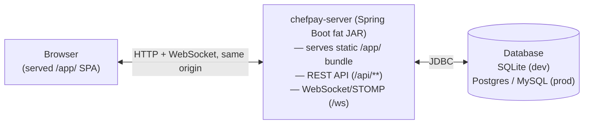

# ChefPay Technical Guide

## Purpose

This guide exists so that once ChefPay is live, a developer who did not build it can make a
**minor change safely** — fix a bug, add a field, change a business rule, add a new integration,
or change SMTP/AI provider configuration — without first having to reverse-engineer the whole
system. It is not a full architecture spec (that's `./ARCHITECTURE.md`) and it is not the schema
reference (that's `./DATA_DICTIONARY.md`); it is the map that tells you *where* to go for a given
kind of change and *what conventions* you must not violate while you're there.

---

## 1. Architecture overview

ChefPay is a Maven multi-module project rooted at `/home/claude/chefpay/`. The parent POM
(`chefpay-parent`, packaging `pom`) targets Java 21 and Spring Boot 3.3.4, and declares four
modules:

- **`chefpay-plugin-api`** — a small set of extension-point interfaces (`ChefPayPlugin`,
  `OnlineOrderProvider`, `PaymentGatewayProvider`, etc.) and their supporting DTOs. It has no
  dependency on `chefpay-core` or `chefpay-server` — it's a pure contract module. See §8.
- **`chefpay-core`** — JPA domain entities and Spring Data repositories. Shared by both
  `chefpay-server` (the web backend) and `chefpay-javafx` (the desktop client), so it has no
  Spring Web/WebSocket dependency — keeping the domain layer reusable and fast to test in
  isolation.
- **`chefpay-server`** — the Spring Boot application: REST API, WebSocket/STOMP, Spring Security,
  Flyway migrations. Packaged as a `jar` via `spring-boot-maven-plugin`, this is what becomes the
  single deployable fat JAR. **This is almost always the module you're changing.**
- **`chefpay-javafx`** — a JavaFX desktop client that talks to the same `chefpay-server` REST API.
  Out of scope for the web deployment this guide covers; it exists and is maintained, but a
  web-only change rarely touches it.

The frontend lives separately in **`chefpay-web/`** (React + TypeScript + Vite). Its
`vite.config.ts` pins two things that matter for deployment: `base: '/app/'` and
`build.outDir: '../chefpay-server/src/main/resources/static/app'` with `emptyOutDir: true`. In
other words, `npm run build` inside `chefpay-web` writes the compiled frontend **directly into**
`chefpay-server`'s static resources. Spring Boot then serves the built app itself, at `/app/`,
from the same origin as the REST API and WebSocket endpoints. There is no separate frontend
deployment and no CORS configuration needed in production — the browser only ever talks to one
origin. (During `npm run dev`, Vite instead proxies `/api` and `/ws` to a locally running
`chefpay-server` on port 8080, purely for local development.)



## 2. Package layout inside `chefpay-server`

All server code lives under `chefpay-server/src/main/java/com/chefpay/server/`. Top-level
packages, one line each:

- `ai` — the AI integration: gate/dispatch (`AiService`), the raw HTTP client (`AiClient`), the
  provider enum, and one controller/service per AI feature (menu import, insights chat, ops
  drafts, menu descriptions, nightly summary). See §7.
- `alerts` — cross-cutting alert dispatch (e.g. critical-alert escalation) built on top of other
  domains' events.
- `areas` — restaurant floor "areas" (seating zones) CRUD.
- `audit` — the tamper-evident audit log (`AuditLog`/`AuditChainState`) and its controller.
- `auth` — login/JWT auth endpoints.
- `billing` — payments, receipts, `EmailReceiptService` (see §6), bill lifecycle.
- `common` — shared plumbing: `ApiResponse`, `ApiException`, correlation-id handling, the global
  exception handler.
- `config` — Spring configuration: `SecurityConfig`, WebSocket config, the SQLite datasource
  profile, the STOMP auth interceptor, and `DataSeeder` (dev bootstrap data).
- `customers` — customer records CRUD.
- `dashboard` — the dashboard summary endpoints.
- `delivery` — delivery-boy assignment/tracking.
- `duepayments` — outstanding/due-payment tracking.
- `eod` — end-of-day session close, Z-report generation/PDF.
- `fraud` — the loss-prevention rule engine (`FraudRuleEngineService` and individual
  `FraudRule` implementations like `ExcessiveDiscountRule`, `PostPrintVoidRule`, etc.).
- `inventory` — stock items, stock transactions.
- `invoices` — supplier invoice intake, including OCR (`OcrService`).
- `kitchen` — kitchen display/ticket flow.
- `kot` — Kitchen Order Ticket number generation/printing.
- `menu` — menu categories/items (`MenuController`, `MenuDtos`) — see §3 for its DTO conventions.
- `notifications` — in-app/notification log.
- `orders` — the order lifecycle (`OrderController`, `OrderService`) — the central domain
  service most integrations should call into rather than duplicate (see §8).
- `pricing` — AI/manual price-change suggestions.
- `printers` — receipt printer profile configuration.
- `purchasing` — purchase orders, auto-replenishment scheduling.
- `recipe` — recipe/ingredient-line definitions used for costing.
- `reports` — reporting endpoints (e.g. menu engineering).
- `reservations` — table reservations/waitlist.
- `restaurant` — the single-tenant `Restaurant` config aggregate (branches, terminals,
  `UpdateRestaurantRequest`) — see §6/§7 for its SMTP/AI fields.
- `retention` — scheduled data-retention auto-purge.
- `specialnotes` — order/item special instructions.
- `tables` — dine-in table CRUD/state.
- `terminals` — POS terminal registration/identity.
- `theme` — UI theme settings.
- `users` — users, roles, permissions (RBAC) — see §3.
- `web` — `AppController`/`ManagerAppController`, the SPA route-forwarding controllers described
  in §1.
- `websocket` — `WebSocketEventPublisher` and STOMP topic publishing.

## 3. Core conventions

These conventions are used everywhere. Get them wrong and your change will compile but behave
subtly incorrectly (silent overwrites, permission leaks, secrets echoed back to the browser).

### Every entity: UUID id, `@Version`, timestamps

`chefpay-core`'s `BaseEntity` (`chefpay-core/src/main/java/com/chefpay/core/domain/BaseEntity.java`)
is a `@MappedSuperclass` every domain entity extends. It supplies:

```java
@Id @GeneratedValue @UuidGenerator
@JdbcTypeCode(SqlTypes.CHAR)
@Column(updatable = false, nullable = false, length = 36)
private UUID id;

@Version
private long version;

private LocalDateTime createdAt;   // set in @PrePersist
private LocalDateTime updatedAt;   // set in @PrePersist and @PreUpdate
```

The `@Version` column is the backbone of optimistic locking: every update DTO carries the
version the client last read (`long version` field, always the last field in the record by
convention — see `MenuDtos.UpdateItemRequest`, `UpdateRestaurantRequest`, etc.), and a stale write
throws Hibernate's `ObjectOptimisticLockingFailureException`, translated by the global exception
handler into the standard error envelope with an entity-appropriate `*_VERSION_CONFLICT` error
code and HTTP 409 — **never** a silent overwrite. If you add a new mutating endpoint, its
"Update...Request" DTO must include a `version` field and the service method must apply it to the
entity before save (Spring Data/Hibernate does the actual version check at flush time).

### Soft delete by default

Nearly every entity uses an `active` boolean rather than a hard delete — filtering out inactive
rows is the default query shape everywhere. The one deliberate exception is category
delete/merge, added in Round 18: `MenuController`'s `DELETE /categories/{id}` and
`POST /categories/{id}/merge` genuinely remove a row from the database, but only after
proving the category is empty (delete) or after moving every item out of it first (merge). Do
not add a second hard-delete path elsewhere without the same "prove it's safe first" discipline —
soft-delete is the correct default for any new entity you add.

### RBAC: permission codes live in the database, not in Java

Controller methods are gated with Spring Security's `@PreAuthorize`, e.g. every mutating method
in `MenuController` carries:

```java
@PreAuthorize("hasAuthority('MENU_MANAGE')")
```

`Permission` (`chefpay-core/.../domain/Permission.java`) is a real `@Entity` (table `permission`)
with a unique `code` column — permission codes are **rows in the database**, not a hardcoded Java
enum. This means granting a new permission to a role, or creating a new role with a custom
permission set, is a data change (via the Users/Roles admin UI or a migration seeding a new
`permission` row), not a code change. When you add a new mutating endpoint, pick an existing
permission code if one fits the domain (`MENU_MANAGE`, etc.) rather than inventing a new one
unless the action is genuinely a new capability that should be independently grantable.

### DTO convention: null means "leave unchanged" — except when it can't

Every `Update...Request` record follows one rule: a null field means "don't touch this attribute."
This keeps PATCH-style updates working with partial payloads from the UI. The complication is
fields where a plain null is ambiguous — it could mean "leave alone" or "clear this to empty" —
and for those the DTO adds an explicit boolean sentinel field instead of overloading null. This is
the single most common mistake a new developer makes on this codebase, so study the worked
example in `chefpay-server/src/main/java/com/chefpay/server/menu/MenuDtos.java`:

```java
public record UpdateCategoryRequest(String name, Integer displayOrder, Boolean active,
                                     UUID parentCategoryId, boolean clearParentCategory, long version) {
}

public record UpdateItemRequest(String name, BigDecimal price, String taxCode, UUID stationId,
                                 boolean clearStation, Boolean vegetarian, String foodType, Boolean available,
                                 Boolean active, Boolean directSale, BigDecimal halfPrice, String barcode,
                                 Integer prepTimeMinutes, long version) {
}
```

`stationId == null` in an `UpdateItemRequest` means "leave the item's assigned kitchen station as
it is" — it does **not** mean "unassign the station." To actually clear a previously-assigned
station, the client must send `clearStation: true`. The same shape appears in
`UpdateCategoryRequest`: `parentCategoryId == null` leaves the category's parent untouched;
`clearParentCategory: true` is required to turn a subcategory back into a top-level category.
`Restaurant.smtpPassword`/`Restaurant.aiApiKey` use a variant of the same idea with a different
mechanism — see §6/§7: there, an **empty string** (not a boolean flag) is the "clear it" signal,
because those fields are plain strings with no natural boolean counterpart already on the DTO and
blank is otherwise a meaningless value for a password/API key.

When you add a nullable field to an `Update...Request` record, ask: can this field ever need to be
explicitly cleared back to "unset," and does null already mean something else for it? If yes, add
a `clearX` boolean sibling (`MenuDtos`'s pattern) or treat blank-string as the clear signal
(`Restaurant`'s pattern) — don't silently assume plain null is enough, or you'll ship a field that
can be set but never unset (which is in fact an accepted, documented limitation today for
`UpdateItemRequest.halfPrice`, `barcode`'s clear-via-blank aside, and `prepTimeMinutes` — see the
class javadoc in `MenuDtos.java` for the exact list of what's accepted as-is).

### Write-only credential fields

`Restaurant.smtpPassword` and `Restaurant.aiApiKey` are persisted columns but are **never**
returned to an API client. `RestaurantDto` only exposes booleans derived from them:

```java
boolean smtpPasswordConfigured,
...
boolean aiApiKeyConfigured,
```

The corresponding `UpdateRestaurantRequest` fields (`smtpPassword`, `aiApiKey`) are write-only:
sending a value sets/replaces the secret; sending null leaves it unchanged; sending an empty
string clears it. This is a straightforward security measure — a credential that's stored server-
side should never round-trip back through a browser response, a network trace, or browser
devtools, even for the user who set it. If you ever add another secret field to `Restaurant` (or
any entity), follow this exact shape: raw field write-only in the update request, a `xConfigured`
boolean in the read DTO, never the raw value in the read DTO.

### The standard API response envelope

Every REST response uses `com.chefpay.server.common.ApiResponse<T>`:

```java
public record ApiResponse<T>(
        boolean success,
        T data,
        String errorCode,
        String message,
        LocalDateTime timestamp,
        String correlationId
) {
    public static <T> ApiResponse<T> ok(T data) { ... }
    public static <T> ApiResponse<T> error(String errorCode, String message) { ... }
}
```

Business-rule failures are signaled by throwing `com.chefpay.server.common.ApiException`
(`ApiException.notFound(...)`, `.badRequest(errorCode, message)`, `.conflict(errorCode, message)`,
`.forbidden(...)`, `.unauthorized(...)`), which the global exception handler translates into the
error-shaped envelope above with the matching HTTP status. Never throw a raw exception from a
controller/service for an expected business-rule failure — always go through `ApiException` so the
client gets a consistent, catchable error shape.

### Idempotency and order numbering

Per `docs/ARCHITECTURE.md` §8 ("Concurrency Strategy"):

- Mutating endpoints that must never double-apply (`POST /api/orders`,
  `POST /api/orders/{id}/items`, payment/close-order endpoints) accept an `Idempotency-Key`
  header. `IdempotencyService` + the `IdempotencyRecord` entity store `(composite_key =
  idempotencyKey + operation) → result` and replay the original response for a repeated key
  instead of re-executing the mutation.
- Order-number generation is a *separate* concurrency problem (avoiding two cashiers getting the
  same order number, not avoiding double-submission of the same request) — solved by
  `NumberGeneratorService` taking a pessimistic write lock on a `NumberSequence` row. SQLite (the
  `dev` profile) has no `SELECT ... FOR UPDATE`; its single-writer transaction serialization is
  relied on instead, a known and accepted gap versus the Postgres/MySQL profiles.
- `@Version` optimistic locking (above) handles the general "two people edited the same row"
  case; the idempotency key and the number-sequence lock handle these two narrower,
  different problems. Don't reach for one when you mean the other.
- WebSocket events (STOMP topics like `/topic/kitchen`, `/topic/orders`) are advisory
  "something changed, go re-fetch" signals, never the source of truth — clients re-fetch via
  REST on a relevant event rather than treating the WS payload as an authoritative patch.

## 4. Data model

The authoritative schema reference is **[`./DATA_DICTIONARY.md`](./DATA_DICTIONARY.md)** — 47
entities, every column and relationship, 1048 lines. Do not duplicate it here; this section is
just an index of its 11 groupings so you know where to look:

- **Organization / Identity** — `Restaurant` (the single-tenant config aggregate, including all
  SMTP/AI/payment settings), `Branch`, `Floor`, `Area`, `Device`.
- **Users & Access** — `AppUser`, `Role`, `Permission` (the RBAC model described in §3).
- **Menu** — `MenuCategory` (with Round 18's parent/subcategory hierarchy), `MenuItem`,
  `KitchenStation`, `Recipe`/`RecipeLine`, `PriceChangeSuggestion`.
- **Tables & Orders** — `RestaurantTable`, `Order` (table `customer_order`), `OrderItem`,
  `SpecialNote`.
- **Billing** — `Tax`, `Discount`, `Payment`, `CashMovement`.
- **Inventory & Suppliers** — `InventoryItem`, `InventoryTransaction`, `Supplier`,
  `PurchaseOrder`/`PurchaseOrderItem`/`PurchaseOrderShareLog`, `SupplierInvoice`/
  `SupplierInvoiceLine`.
- **Customers & Reservations** — `Customer`, `Reservation`.
- **Notifications & Audit** — `Notification`, `NotificationLog`, `Anomaly`, `RuleConfig`
  (the fraud rule engine's tunables), `AuditLog`/`AuditChainState`.
- **EOD / Loss Prevention** — `EodSession`, `ChannelIngestion`, `AggregatorSettlement`,
  `CashCount`.
- **Reference / Support** — `IdempotencyRecord`, `NumberSequence`, `PrinterProfile`,
  `ThemeSettings`.
- **Other** — `DeliveryBoy` and any remaining entity not grouped above.

### Schema changes: Flyway is the source of truth in production

`chefpay-server/src/main/resources/db/migration/` holds `V1__phase1_schema.sql` through
`V27__round18_category_hierarchy_and_merge.sql` — this is the production (Postgres/MySQL) schema
history, applied by Flyway on startup. The SQLite dev profile does **not** run Flyway; it uses
Hibernate's `ddl-auto: update` to keep the local dev database in sync with the entity classes
automatically. This means **any schema change you make must still be added as a new migration
file**, even though your local dev loop won't require it to run — production deployments (and
anyone running the Postgres/MySQL profile) depend on it.

The naming convention (see the existing files) is `V<next-number>__<round-or-phase>_<short_
description>.sql`, all lowercase, words separated by underscores, e.g.
`V15__round11_smtp_config.sql`, `V24__menu_item_prep_time_and_category_update.sql`,
`V27__round18_category_hierarchy_and_merge.sql`. The next migration you write should be
`V28__<your_description>.sql`. A minimal template, modeled on `V24`'s single-column addition:

```sql
-- <One or two sentences: what this adds and why, matching the style of prior migration headers.>
-- SQLite (default 'dev' profile) uses Hibernate ddl-auto instead, same as every other migration in
-- this project - see V1's header note.

ALTER TABLE menu_item ADD COLUMN your_new_column INTEGER;
```

Keep each migration focused on the round/change it belongs to, and give it a header comment in the
same style as the existing files (what it adds, whether anything downstream reads the new column
yet, and any deliberate limitation) — the migration files double as a lightweight changelog for the
schema.

## 5. Visual orientation

Two screenshots are useful reference points for the sections below: the Menu Editor
([`./screenshots/06-menu-editor.png`](./screenshots/06-menu-editor.png)) for §9's worked example,
and Settings ([`./screenshots/08-settings.png`](./screenshots/08-settings.png)) for §6/§7's
SMTP/AI configuration screens.

## 6. Changing SMTP / email-receipt integration

There is **no separate "email service config file."** SMTP is entirely per-restaurant, runtime,
database-driven configuration, not a Spring Boot `spring.mail.*` deployment property — the app
sets none of those properties. `EmailReceiptService`
(`chefpay-server/src/main/java/com/chefpay/server/billing/EmailReceiptService.java`) builds a
fresh `JavaMailSenderImpl` on every single send, populated straight from the current `Restaurant`
row's `smtpHost`/`smtpPort`/`smtpUsername`/`smtpPassword`/`smtpFromAddress`/`smtpUseTls` fields:

```java
JavaMailSenderImpl mailSender = new JavaMailSenderImpl();
mailSender.setHost(restaurant.getSmtpHost());
mailSender.setPort(restaurant.getSmtpPort() == null ? 587 : restaurant.getSmtpPort());
...
props.put("mail.smtp.starttls.enable", restaurant.isSmtpUseTls());
if (restaurant.getSmtpPort() != null && restaurant.getSmtpPort() == 465) {
    props.put("mail.smtp.socketFactory.port", "465");
    props.put("mail.smtp.socketFactory.class", "javax.net.ssl.SSLSocketFactory");
}
```

Port 465 auto-switches to an implicit-SSL socket factory rather than STARTTLS, with no separate UI
toggle needed for that case. `sendDocument(toEmail, subject, bodyText)` is the one method that
actually sends (`sendReceipt` is a thin wrapper for the "Receipt - <order number>" subject line;
purchase-order emails reuse `sendDocument` directly with a "Purchase Order - PO-..." subject) —
every failure mode (not configured, bad recipient, unreachable/rejecting server) is caught and
re-thrown as `ApiException`, never a raw `MessagingException`, so the client always gets the
standard error envelope.

Because of this design, the exact place to touch depends on what kind of SMTP change you're
making:

1. **A new SMTP-related setting a restaurant should be able to configure** (e.g. a reply-to
   address, a CC list) — add the field to the `Restaurant` entity, and write a new
   `V28__...sql` migration for it (following §4's naming convention; `V15__round11_smtp_config.sql`
   is the original SMTP-fields migration to model yours on).
2. **Exposing that new field to the API/UI** — add it to `RestaurantDto` and
   `UpdateRestaurantRequest` (`chefpay-server/src/main/java/com/chefpay/server/restaurant/`), then
   to the Settings page in `chefpay-web`. If it's a secret, follow the write-only-credential
   pattern from §3, not a plain read/write field.
3. **Changing what actually gets sent, or how** — edit `EmailReceiptService.sendDocument()`
   itself. Examples: switching from plain-text to HTML email (change
   `helper.setText(bodyText, false)`'s second argument and build real HTML), adding a PDF/receipt
   attachment (`MimeMessageHelper` supports `addAttachment(...)`; you'd need to construct it with
   `multipart = true`), or adding a provider-specific quirk for a particular SMTP host.

In practice, the overwhelming majority of "SMTP changes" a support request will ask for are (1) +
(2) — a new Settings field and a database column — not a code change to the sending logic at all.

## 7. Changing AI integration

### How it's wired today

`AiService` (`chefpay-server/src/main/java/com/chefpay/server/ai/AiService.java`) is the **only**
class in the server that reads `Restaurant.aiApiKey` back out. Every AI-backed feature's
controller/service calls `assertEnabled(restaurant, featureFlag, featureName)` first — the
three-gate check that must all pass before any request reaches a third party:

```java
public void assertEnabled(Restaurant restaurant, boolean featureFlag, String featureName) {
    if (!restaurant.isAiFeaturesEnabled()) { ... }                 // 1. master switch
    if (restaurant.getAiApiKey() == null || ... isBlank()) { ... } // 2. non-blank key
    if (AiProvider.fromCode(restaurant.getAiProvider()) == null) { ... } // provider selected
    if (!featureFlag) { ... }                                       // 3. this feature's own switch
}
```

Any failed gate throws a 400 `ApiException` (`AI_NOT_CONFIGURED` / `AI_FEATURE_DISABLED`), never a
500 — every AI endpoint fails the same predictable, user-actionable way.

`AiClient` (`chefpay-server/src/main/java/com/chefpay/server/ai/AiClient.java`) is the lowest-level
piece: one `chat(...)` call in, one HTTP request out, dispatched by a `switch (provider)` over the
`AiProvider` enum (`OPENAI`, `ANTHROPIC`, `GEMINI` — `chefpay-server/.../ai/AiProvider.java`, backed
by a plain string column, not a join table, since there's exactly one active provider per
restaurant). It's built on the JDK's own `java.net.http.HttpClient` and Jackson's `ObjectMapper`
deliberately, not a provider SDK — each provider's chat-completion HTTP contract was hand-built
directly against public API docs (OpenAI's `/v1/chat/completions`, Anthropic's `/v1/messages`,
Gemini's `.../models/{model}:generateContent`). `AiClient` is never called directly from a
controller — always go through `AiService`, which owns the enablement gate and exception
translation `AiClient` deliberately does not do.

### Adding a fourth AI provider

1. Add the new value to the `AiProvider` enum (`OPENAI, ANTHROPIC, GEMINI, <NEW>`) —
   `fromCode` already handles it generically via `valueOf`, nothing else to change there.
2. In `AiClient.chat(...)`, add a `case <NEW> ->` branch to **both** `switch` statements: the
   request-building `switch` (add a `buildNewProviderRequest(...)` private method mirroring
   `buildOpenAiRequest`/`buildAnthropicRequest`/`buildGeminiRequest` — construct the provider's
   JSON body with Jackson's `ObjectNode`/`ArrayNode`, set its auth header, return the
   `HttpRequest`) and the response-extraction `switch` (add an `extractNewProviderText(...)`
   method mirroring the existing `extractXText` methods — parse the JSON body and pull out the
   assistant's text).
3. If the new provider needs a default model name when the restaurant hasn't picked one, follow
   the existing pattern (`model == null || model.isBlank() ? "<default-model>" : model`).
4. No changes needed to `AiService` or any feature controller — they only ever call
   `aiClient.chatText(...)`/`chatWithImage(...)` with an `AiProvider` value, which now includes
   yours automatically once the Settings UI lets a restaurant pick it.

### Changing an AI feature's behavior or prompt

Each AI feature keeps its own system prompt as a `private static final String SYSTEM_PROMPT` (a
Java text block) right inside its own controller or service — there is no shared/central prompt
file. Changing what a feature asks the AI to do, or how it phrases the request, is almost always
just editing that constant, not touching `AiService`/`AiClient` at all:

- **Menu import** (photo/PDF → draft menu items) — `AiMenuImportController.java`
  (`SYSTEM_PROMPT`), uses `aiService.chatWithImage(...)`.
- **Ask Your Data / insights chat** — `AiInsightsController.java` (`SYSTEM_PROMPT`).
- **Reorder drafts and anomaly scan** — `AiOpsController.java`, which keeps two separate
  constants: `REORDER_SYSTEM_PROMPT` and `ANOMALY_SYSTEM_PROMPT`.
- **AI-written menu item descriptions** — `AiMenuDescriptionController.java` (`SYSTEM_PROMPT`).
- **Nightly sales summary** — the prompt lives in `AiNightlySummaryService.java`
  (`SYSTEM_PROMPT`); `AiNightlySummaryScheduler` just triggers the service on a schedule, and
  `AiNightlySummaryController` exposes it on demand.
- There's also a natural-language ops assistant, `AiOpsAssistantService.java`
  (`SYSTEM_PROMPT`), fronted by `AiOpsAssistantController`.

If a feature's output needs reshaping (e.g. asking for stricter JSON), edit its prompt constant
and, if the shape of the expected response changes, the corresponding parsing code right below
where `aiService.chatText(...)`/`chatWithImage(...)` is called in that same file. `AiService`'s
`stripCodeFence(...)` helper (which strips a ```` ```json ... ``` ```` fence some models wrap
structured output in) is shared and rarely needs touching.

## 8. Architecture for any further integration

`chefpay-plugin-api` already defines a clean, honest set of extension-point interfaces — but be
clear-eyed about their current state: **none of them are wired to any loader/registry in
`chefpay-server` today.** This is intentional scaffolding for future integrations, not yet an
active plugin system — there is no `PluginManager`, no scheduled poller, and no Settings > Plugins
screen. Don't assume implementing one of these interfaces alone does anything; it doesn't, until
someone builds the wiring described below.

The module's interfaces (`chefpay-plugin-api/src/main/java/com/chefpay/plugin/api/`):

- `ChefPayPlugin` — the base contract every plugin implements: id/name/description/version,
  `PluginCategory`, a declarative `getConfigSchema()` (`List<ConfigField>`) for the config form,
  `init(PluginContext)`/`shutdown()` lifecycle hooks, and `healthCheck()` for a "Test connection"
  button.
- `OnlineOrderProvider` — `pollNewOrders()`, `acknowledgeOrder(externalOrderId)`,
  `pushStatusUpdate(externalOrderId, status)`, `syncMenu(menu)` — for a food-delivery aggregator
  or the restaurant's own storefront.
- `PaymentGatewayProvider` — `charge(PaymentRequestDto)`, `refund(transactionReference, original)`
  — for a card/UPI/wallet gateway.
- `BiometricAuthProvider`, `ReceiptPrinterDriver`, `CashDrawerDriver`, `CctvProvider`,
  `GlSyncAdapter`, `BillNotifier` — the remaining hardware/software extension points.
- Supporting types: `ConfigField`/`ConfigFieldType` (the declarative config-form schema),
  `PluginCategory`, `PluginContext`, `PluginLogger`, `PluginConfigurationException`,
  `HealthStatus`, `RestaurantInfo`, `CriticalAlertChannel`, and the `dto` package
  (`ExternalOrderDto`, `MenuItemDto`, `BillDto`/`BillLineItemDto`, `CustomerDto`,
  `PaymentRequestDto`/`PaymentResultDto`, `NotificationResult`).

### The recommended pattern (follow the AI integration's shape)

`docs/ARCHITECTURE.md` §13b spells this out for an online-order aggregator specifically, but the
shape generalizes to any real integration — it's the same shape §6/§7's AI/SMTP integrations
already use successfully: config lives on `Restaurant` (or a small dedicated entity + migration if
it needs more than a handful of fields), one dedicated `@Service`/`@Component` is the only class
that talks to the third party, and existing domain service methods do all the real work — no new
order-lifecycle logic gets written per-integration.

Concretely:

1. Implement the relevant `chefpay-plugin-api` interface as a Spring `@Component` (picked up
   automatically once a `PluginManager` exists to look for it — or, until that's built, wire it in
   directly as an ordinary Spring bean/scheduled service, which is a perfectly reasonable interim
   step for the first real integration).
2. Add a scheduled poller (`@Scheduled`, same idiom as `AutoReplenishmentScheduler` in
   `purchasing` or `AiNightlySummaryScheduler` in `ai`) or a webhook `@RestController` endpoint,
   whichever the integration's API style calls for.
3. Convert the external payload into a real domain object using **existing** service methods —
   for an order-taking integration, `OrderService.openOrCreateOrder(...)` followed by
   `OrderService.addItem(...)` (both in
   `chefpay-server/src/main/java/com/chefpay/server/orders/OrderService.java`), tagging the
   created order with the integration's source/external id so it's reconcilable. Do not write a
   parallel order-creation path — an aggregator/gateway order should flow through the exact same
   kitchen ticket queue, billing screens, and WebSocket events a dine-in order does.
4. Store the integration's own configuration (API keys, endpoint URLs, merchant IDs) as new fields
   on `Restaurant` plus a `V28__...sql`-style migration (§4), following the **exact same
   write-only-secret convention** as `smtpPassword`/`aiApiKey` (§3/§6/§7): the raw secret only ever
   appears in the corresponding `Update...Request`, never in the read DTO, which instead exposes an
   `xConfigured` boolean. If the integration needs more than a handful of config fields, give it
   its own small entity + migration instead of further bloating `Restaurant`.
5. Call back out to the third party (`acknowledgeOrder`, `pushStatusUpdate`, gateway `charge`/
   `refund`) from the same points in `OrderService`/`BillingController` where the corresponding
   domain event already fires today (order accepted into the kitchen, status transitions, payment
   recorded) — reuse the state transitions already firing on `/topic/kitchen`/`/topic/orders`
   rather than inventing a second notification path.

### Worked example: adding a new payment gateway end-to-end

1. Implement `PaymentGatewayProvider` in a new class, e.g.
   `chefpay-server/.../billing/RazorpayGatewayProvider.java`, implementing `charge(...)` (and
   `refund(...)` if the gateway supports it) against that gateway's HTTP API — following
   `AiClient`'s precedent of a plain `HttpClient` call rather than pulling in an unverified SDK
   dependency, unless you've confirmed the SDK actually resolves.
2. Add the gateway's credentials (API key/secret, merchant id) as new fields on `Restaurant` (e.g.
   `razorpayKeyId`, `razorpayKeySecret`, `razorpayEnabled`) plus a new `V28__...sql` migration,
   with `razorpayKeySecret` write-only per the §3/§6/§7 pattern.
3. Expose the non-secret fields (and an `razorpaySecretConfigured` boolean) on `RestaurantDto`, and
   the writable ones on `UpdateRestaurantRequest`, then add the Settings UI fields in
   `chefpay-web`.
4. In the billing flow (`BillingController`/wherever payment method is currently recorded
   manually), branch to `RazorpayGatewayProvider.charge(...)` when the gateway is enabled and the
   chosen payment method matches, and fall back to today's manual "just record the chosen method"
   path when it isn't — never remove the manual path, since v1's requirement that payments can
   always be recorded manually (cash, UPI, card, no integration) stays true for restaurants that
   never configure a gateway.
5. On a successful `PaymentResultDto`, call the *existing* order/bill-closing service methods
   (whatever `OrderService`/`BillingController` already calls when a manual payment is recorded)
   rather than writing new "payment succeeded" logic — the gateway is just a different way of
   confirming the same payment, not a different kind of payment.

## 9. Worked example: adding a minor feature end-to-end

To see the full vertical slice a small feature actually touches, look at how
`MenuItem.prepTimeMinutes` was added (Round 15/"Web Modernization"), still visible in the current
code:

1. **Entity** — `chefpay-core/src/main/java/com/chefpay/core/domain/MenuItem.java` gained one
   field: `private Integer prepTimeMinutes;`, documented as display-only (nothing in the kitchen/
   order flow reads it).
2. **Migration** —
   `chefpay-server/src/main/resources/db/migration/V24__menu_item_prep_time_and_category_update.sql`:

   ```sql
   ALTER TABLE menu_item ADD COLUMN prep_time_minutes INTEGER;
   ```

   with a header comment explaining scope (display-only, no schema change needed for other
   changes bundled into the same round).
3. **DTO records** — `chefpay-server/src/main/java/com/chefpay/server/menu/MenuDtos.java`:
   `ItemDto` gained `Integer prepTimeMinutes` (read side); `CreateItemRequest` and
   `UpdateItemRequest` both gained `Integer prepTimeMinutes` (write side) — following §3's "null
   means unchanged" rule, accepting as a known limitation that this particular field can't be
   cleared back to null once set through this endpoint (documented right in the class javadoc).
4. **Controller/service** — `MenuController`/the menu service already had generic create/update
   methods; the new field just needed to be read off the request and set on the entity alongside
   every other field, no new endpoint required.
5. **Frontend types** — `chefpay-web/src/types/api.ts` gained `prepTimeMinutes: number | null` on
   the read type and `prepTimeMinutes?: number | null` on the create/update request types (lines
   153, 448, 466 in that file).
6. **Frontend page** — `chefpay-web/src/pages/MenuEditorPage.tsx` added local state
   (`useState` for the string form value), parsed it to a number-or-null before submitting, and
   added the actual input control to the item edit form.

The equivalent shape for `MenuCategory.parentCategory` (Round 18's category hierarchy) is the
same six steps, just with `UUID`/boolean-sentinel fields (`parentCategoryId` +
`clearParentCategory`, per §3) instead of a plain nullable integer — read
`V27__round18_category_hierarchy_and_merge.sql` and the `CategoryDto`/`UpdateCategoryRequest`
records in the same `MenuDtos.java` file for that variant.

Use this as your template for any "add one field" change: entity → migration → DTO records
(read + create + update) → controller/service wiring (usually just passing the field through) →
frontend type → frontend page.

## 10. Build & verify discipline

Be honest with yourself about the provenance of any change you're reviewing or making: this
codebase has been maintained under a sandbox where Maven Central was blocked, so changes have
been hand-verified — careful reading, exact signature/argument-count matching, brace/paren balance
checks — rather than actually compiled. Don't assume "it's in the repo" means "it built." The
first thing to do after making any change here, before trusting it, is to actually compile it:

```
mvn -pl chefpay-core,chefpay-server -am compile
```

and, for any frontend change, from `chefpay-web`:

```
npm run build
npm run lint
tsc -b
```

For full build/run instructions — local workspace setup, producing the deployable server JAR,
choosing a production database, scaling for a larger client, and a step-by-step Oracle Cloud
deployment walkthrough — see [`DEPLOYMENT_GUIDE.md`](./DEPLOYMENT_GUIDE.md) in this same `docs/`
folder. `README.md` at the repo root also has the round-by-round change history if you need to
trace when a particular piece of behavior was introduced.
